<h2>Three bots have been collecting words from Twitter for the past year.</h2>

They've looked for certain sentences and extracted the X.

<ul>
<li><a href="https://twitter.com/lovihatibot" target="_self">@lovihatibot</a> -- "I love/hate the word X"</li>
<li><a href="https://twitter.com/nixibot" target="_self">@nixibot</a> -- "X is not/isn't/ain't a word"</li>
<li><a href="https://twitter.com/favibot" target="_self">@favibot</a> -- "X is my new favorite/favourite/fave word"</li>
</ul>

Combining and comparing the logs of all three, let's see the top words of 2015. <strong>Bold</strong> means a word wasn't in that chart in 2014.

<strong>Combined output</strong>

2015 total: 219,918

<ol>
<li>bae (9,513)</li>
<li>mines (4,282)</li>
<li>no (4,239)</li>
<li>love (2,353)</li>
<li>moist (2,345)</li>
<li><strong>lit (2,184)</strong></li>
<li>loyalty (1,984)</li>
<li>ain't (1,725)</li>
<li>conversate (1,664)</li>
<li><strong>fleek (1,525)</strong></li>
<li>justice (1,470)</li>
<li>soon (1,420)</li>
<li>impossible (1,306)</li>
<li>homophobia (1,276)</li>
<li>cunt (1,258)</li>
<li><strong>year (1,219)</strong></li>
<li><strong>forever (1,214)</strong></li>
<li><strong>fam (1,149)</strong></li>
<li>sorry (1,114)</li>
<li>panties (1,060)</li>
</ol>
<table>
<tbody>
<tr>
<th>lovihatibot</th>
<th>nixibot</th>
<th>favibot</th>
</tr>
<tr>
<td style="text-align: center;">2015 total: 125,867</td>
<td style="text-align: center;">2015 total: 81,960</td>
<td style="text-align: center;">2015 total: 13,976</td>
</tr>
<tr>
<td>
<ol>
<li>bae (9,151)</li>
<li>no (4,004)</li>
<li>moist (2,341)</li>
<li><strong>lit (2,107)</strong></li>
<li>soon (1,409)</li>
<li>homophobia (1,278)</li>
<li>fleek (1,274)</li>
<li>cunt (1,182)</li>
<li><strong>fam (1,077)</strong></li>
<li>panties (1,069)</li>
<li>sorry (1,014)</li>
<li><strong>fuckboy (941)</strong></li>
<li>bitch (880)</li>
<li>sexy (860)</li>
<li>babe (815)</li>
<li><strong>slay (771)</strong></li>
<li>thot (758)</li>
<li>pussy (706)</li>
<li>fuck (698)</li>
<li>love (672)</li>
</ol>
</td>
<td>
<ol>
<li>mines (4,299)</li>
<li>loyalty (2,000)</li>
<li>love (1,702)</li>
<li>ain't (1,678)</li>
<li>conversate (1,661)</li>
<li>justice (1,472)</li>
<li>impossible (1,283)</li>
<li><strong>year (1,226)</strong></li>
<li>irregardless (1,027)</li>
<li>forever (953)</li>
<li>funner (717)</li>
<li>worser (641)</li>
<li>bestest (517)</li>
<li>marriage (514)</li>
<li>anyways (507)</li>
<li>alot (496)</li>
<li><strong>hurted (443)</strong></li>
<li>stupider (442)</li>
<li><strong>conversating (426)</strong></li>
<li>bae (413)</li>
</ol>
</td>
<td>
<ol>
<li><strong>rendezvous (165)</strong></li>
<li>no (119)</li>
<li><strong>lit (97)</strong></li>
<li><strong>savage (83)</strong></li>
<li>yikes (82)</li>
<li>fuckboy (81)</li>
<li>cunt (60)</li>
<li><strong>fam (50)</strong></li>
<li>twat (42)</li>
<li><strong>sensational (37)</strong></li>
<li>bitch (37)</li>
<li>fuck (37)</li>
<li><strong>fuckery (29)</strong></li>
<li><strong>tragic (29)</strong></li>
<li>irrelevant (27)</li>
<li>wow (26)</li>
<li><strong>kerfuffle (23)</strong></li>
<li><strong>groovy (22)</strong></li>
<li>rad (22)</li>
<li><strong>hoe (21)</strong></li>
</ol>
</td>
</tr>
</tbody>
</table>

Here's top 10 charts for each phrase from each bot.

<h2>@lovihatbot</h2>
<table>
<tbody>
<tr>
<th>I love the word X</th>
<th>I hate the word X</th>
</tr>
<tr>
<td>
<ol>
<li>cunt (1,253)</li>
<li>fuck (1,075)</li>
<li>bae (1,029)</li>
<li>thot (700)</li>
<li>bitch (661)</li>
<li>babe (497)</li>
<li>woman (323)</li>
<li><strong>moist (309)</strong></li>
<li><strong>delicious (295)</strong></li>
<li>rad (269)</li>
</ol>
</td>
<td>
<ol>
<li>bae (22,926)</li>
<li>no (6,274)</li>
<li>thot (6,155)</li>
<li>moist (2,967)</li>
<li>homophobia (2,052)</li>
<li><strong>soon (1,700)</strong></li>
<li>panties (1,671)</li>
<li>selfie (1,506)</li>
<li><strong>sorry (1,446)</strong></li>
<li>sexy (1,281)</li>
</ol>
</td>
</tr>
</tbody>
</table>
<h2>@nixibot</h2>
<table>
<tbody>
<tr>
<th>X is not a word</th>
<th>X isn't a word</th>
<th>X ain't a word</th>
</tr>
<tr>
<td>
<ol>
<li>mines (2,682)</li>
<li>loyalty (1,622)</li>
<li>impossible (1,159)</li>
<li>love (1,154)</li>
<li>conversate (1,101)</li>
<li>forever (909)</li>
<li>irregardless (774)</li>
<li><strong>year (689)</strong></li>
<li><strong>marriage (422)</strong></li>
<li><strong>worser (355)</strong></li>
</ol>
</td>
<td>
<ol>
<li>mines (1,483)</li>
<li>justice (1,454)</li>
<li>ain't (722)</li>
<li><strong>year (530)</strong></li>
<li>conversate (523)</li>
<li>love (475)</li>
<li>funner (423)</li>
<li>bestest (342)</li>
<li>stupider (303)</li>
<li><strong>worser (254)</strong></li>
</ol>
</td>
<td>
<ol>
<li>ain't (611)</li>
<li>loyalty (152)</li>
<li>ignorantest (115)</li>
<li>mines (79)</li>
<li>love (60)</li>
<li>impossible (51)</li>
<li>just (43)</li>
<li>conversate (29)</li>
<li>worser (27)</li>
<li><strong>bestest (26)</strong></li>
</ol>
</td>
</tr>
</tbody>
</table>
<h2>@favibot</h2>
<table>
<tbody>
<tr>
<th>X is my new favorite word</th>
<th>X is my new favourite word</th>
<th>X is my new fave word</th>
</tr>
<tr>
<td>
<ol>
<li>no (109)</li>
<li><strong>rendezvous (97)</strong></li>
<li><strong>lit (83)</strong></li>
<li><strong>yikes (64)</strong></li>
<li><strong>savage (61)</strong></li>
<li>fuckboy (54)</li>
<li>cunt (44)</li>
<li><strong>fam (43)</strong></li>
<li><strong>fuck (31)</strong></li>
<li><strong>sensational (29</strong>)</li>
</ol>
</td>
<td>
<ol>
<li><strong>rendezvous (60)</strong></li>
<li><strong>fuckboy (22)</strong></li>
<li><strong>savage (18)</strong></li>
<li><strong>cockwomble (16)</strong></li>
<li>cunt (14)</li>
<li><strong>yikes (13)</strong></li>
<li>twat (11)</li>
<li><strong>lit (11)</strong></li>
<li>sassy (9)</li>
<li><strong>hunty (8)</strong></li>
</ol>
</td>
<td>
<ol>
<li><strong>nondindwa (8)</strong></li>
<li><strong>rendezvous (8)</strong></li>
<li><strong>wow (7)</strong></li>
<li><strong>yikes (5)</strong></li>
<li><strong>twat (5)</strong></li>
<li><strong>tragic (5)</strong></li>
<li>fuckboy (5)</li>
<li><strong>problematic (4)</strong></li>
<li><strong>dope (4)</strong></li>
<li><strong>savage (4)</strong></li>
</ol>
</td>
</tr>
</tbody>
</table>
<h2>Change from 2013</h2>

Let's see how mentions have changed for some of <a href="../../2013/twitters-new-favourite-words">2013's words</a>.

People talking about words ‒ especially new favourite words, or loved words, or hated words, or words they've decided don't exist ‒ may be a good indicator of brand new words or at least words with new currency. Both increases and decreases may reflect an underlying change in use, and decreases may reflect an acceptance of the words.

<em>Bae </em>(babe) emerged in April 2013, peaked at 3,880 in May 2014 and whilst still popular, has tailed off to 437 by December 2015.

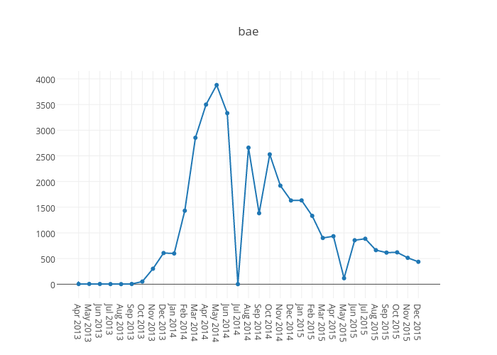

Similarly,<em> t</em><em>hot</em> ("that hoe over there") emerged in March 2013 and grew steadily to a peak of 1,400 uses in March 2014 and dropped off to 28 by December 2015.

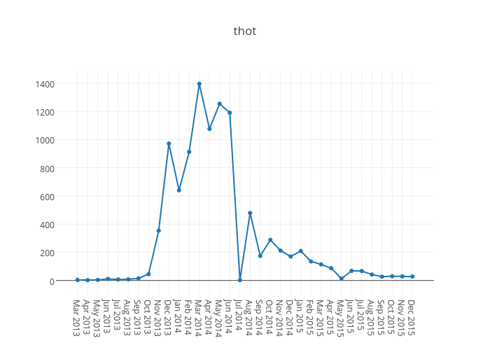

<em><em>Selfie</em></em> (a shared photo taken with a phone) had a couple of mentions in April 2013, and peaked in March 2014 with 373, ending the year with 18 in December 2015.

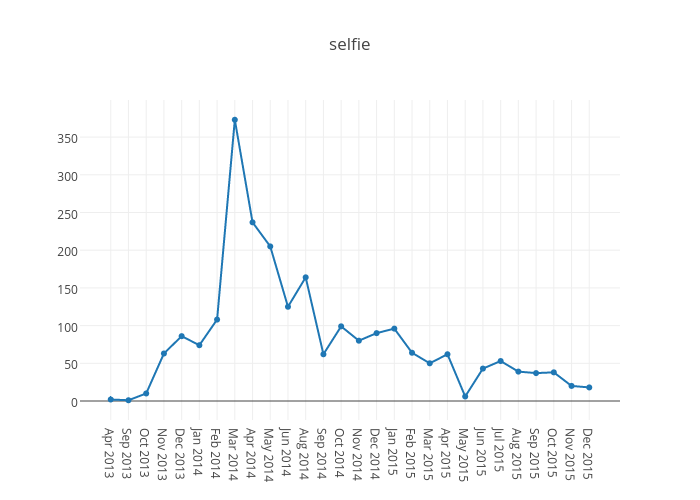

<em>Ratchet</em> (a diva) peaked with 130 in March 2014, dropping to 4 by December 2015. All but *ratchet* still show up in the charts.

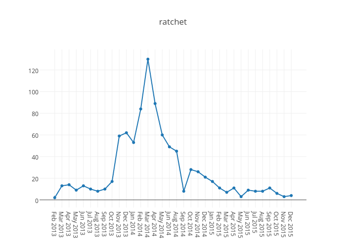

<h2>Changes from 2014</h2>

From <a href="../../2015/twitter-woty-2014">2014</a>:

<em>Fleek</em>, or more fully <em>on fleek</em>, means on point, on the mark, stylish, amazing or impeccable. First mentioned in August 2014, it's dropped off to 14 by December 2015.

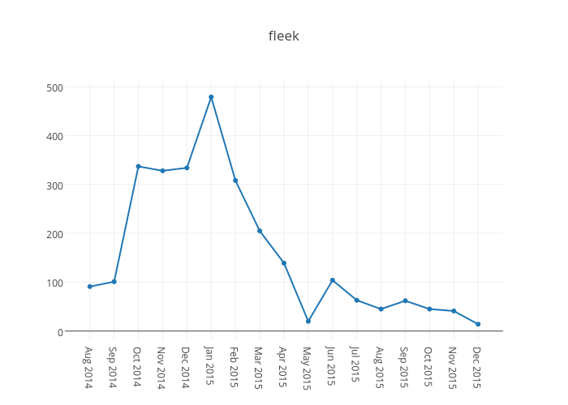

<em>Bruh</em> (bro, brother), not a new word but with just a few mentions throughout 2013, picked up in March 2014, and peaked in June/July 2014, but went down to 16 by December 2015 and doesn't make the top charts.

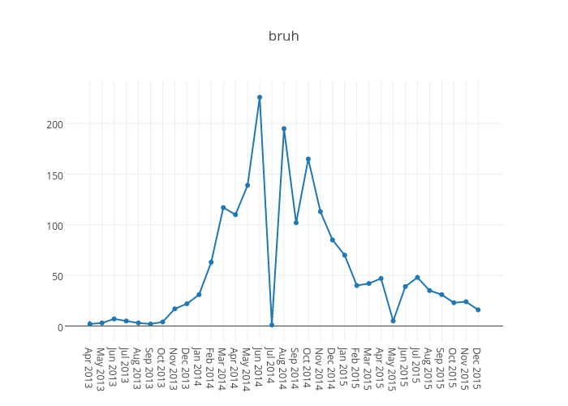

<em>Fuckboy</em> still charts for favibot, but peaked in March 2015 with 202 and down to 37 by year end.

Both <em>hella</em> and <em>twizzle</em> have dropped off the charts, the latter being a one-off from the 2014 winter Olympics.

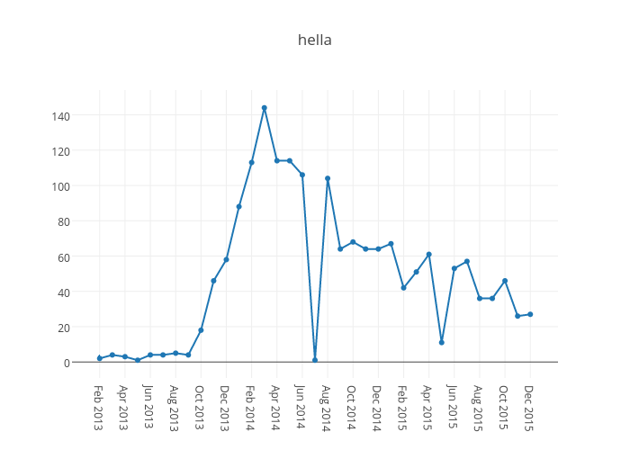

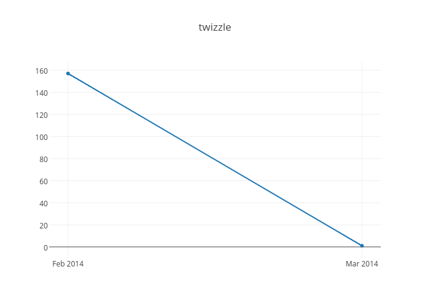

<h2>New in 2015</h2>

Here's a few new to these charts.

<em>Lit</em> is the surprise new entry. It's commonly used as "lit af", or "lit as fuck", for example <a href="https://twitter.com/BeyondBetter_/status/682990826499211268">in this tweet</a>:

<blockquote>

My Year is starting off lit af👌🏼 ...but is gonna be TD by Monday morning

</blockquote>

Something, I'm not sure what, happened in June 2015 that caused its use to explode on Twitter:

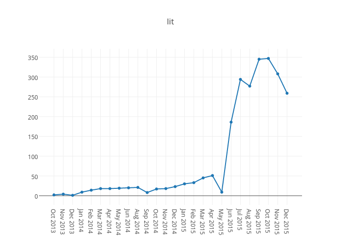

<em>Fam</em> (from family, for those closest to you but not necessarily family), has been around a long time, became popular towards the end of 2014 and is still talked about.

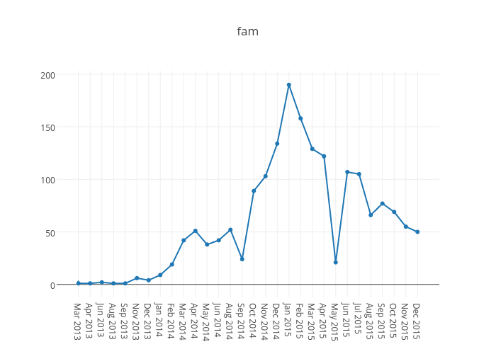

Similarly, <em>slay</em> ("<a href="https://www.urbandictionary.com/define.php?term=slay&amp;defid=7222797">killed it. succeeded in something amazing</a>", "<a href="https://www.urbandictionary.com/define.php?term=slay&amp;defid=7842546">something you tell someone when they look sexy as f***</a>") has been around for a while and grew towards the end of 2014, peaking in April 2015.

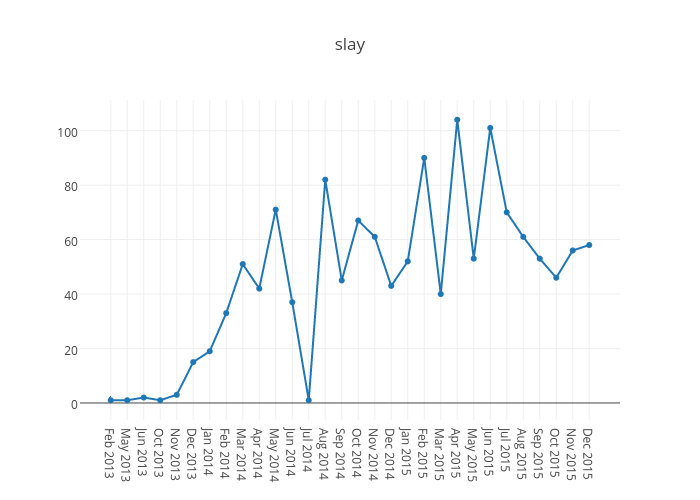

<h2>2016</h2>

For words causing a reaction in 2016, follow <a href="https://twitter.com/lovihatibot" target="_self">@lovihatibot</a>, <a href="https://twitter.com/nixibot" target="_self">@nixibot</a> and <a href="https://twitter.com/favibot" target="_self">@favibot</a> on Twitter.

