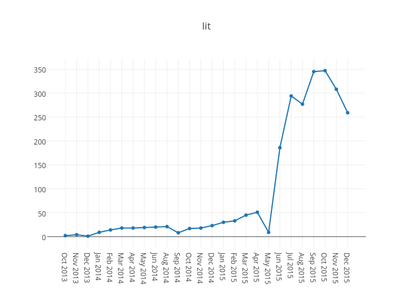

Here's some quick charts of some of the words nominated for American Dialect Society
2015 Words of the Year
[PDF](https://americandialect.org/wp-content/uploads/2015-WOTY-nominations.pdf)), data
taken from a corpus of words talked about on Twitter
([read more about them here](../twitter-woty-2015)), as collected by
[a trio of bots](https://twitter.com/hugovk/lists/notabletwitterwordbots). Notable
troughs are generally when the bots were offline.

## From my [2015 nominations](../twitter-woty-2015):

Lit, fleek: see above.

And [for my 2013 nominations see here](../twitter-woty-2015).
