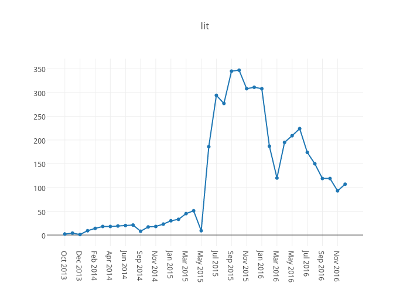
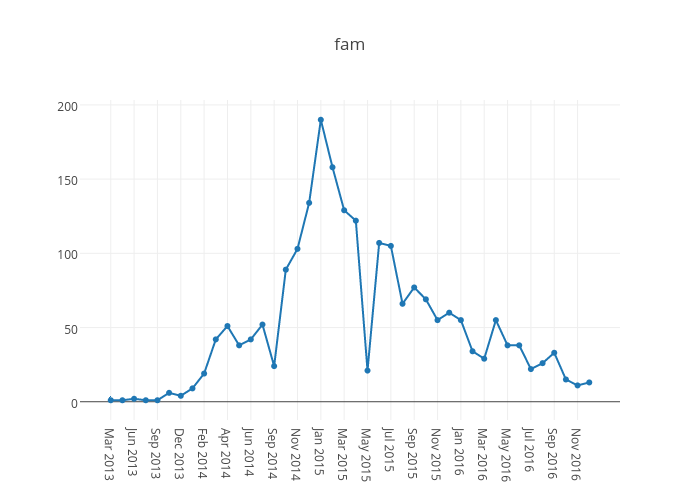
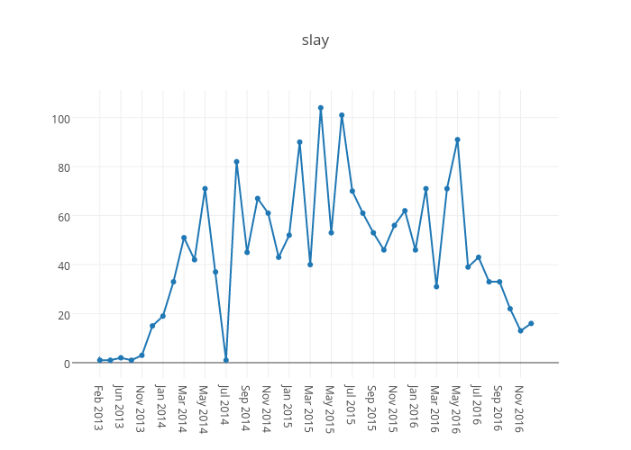
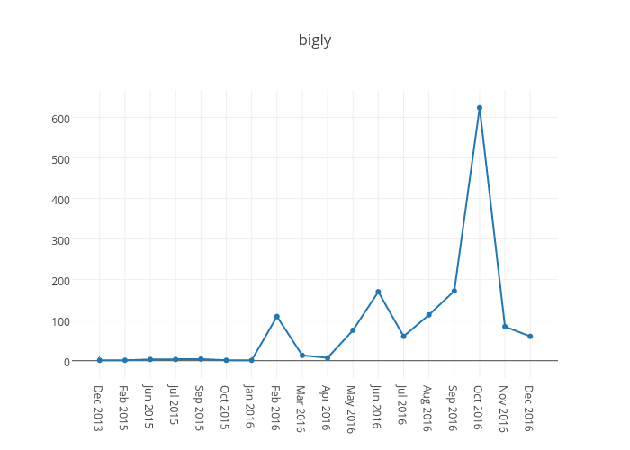
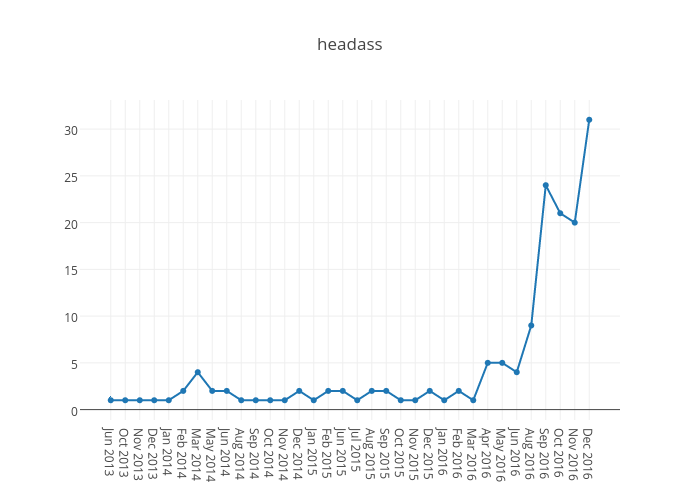

<h2>Three bots have been collecting words from Twitter for the past year.</h2>

They've looked for certain sentences and extracted the X.

<ul>
<li><a href="https://twitter.com/lovihatibot" target="_self">@lovihatibot</a> -- "I love/hate the word X"</li>
<li><a href="https://twitter.com/nixibot" target="_self">@nixibot</a> -- "X is not/isn't/ain't a word"</li>
<li><a href="https://twitter.com/favibot" target="_self">@favibot</a> -- "X is my new favorite/favourite/fave word"</li>
</ul>

Combining and comparing the logs of all three, let's see the top words of 2016. <strong>Bold</strong> means a&nbsp;word wasn't in that chart in 2015.

<strong>Combined output</strong>

Total in 2016: 168,241

<ol>
<li>mines (4,060)</li>
<li>bae (3,369)</li>
<li>no (2,582)</li>
<li>forever (2,143)</li>
<li>lit (2,005)</li>
<li>moist (1,805)</li>
<li>love (1,790)</li>
<li><strong>bigly (1,488)</strong></li>
<li>conversate (1,358)</li>
<li>ain't (1,339)</li>
<li><strong>irregardless (1,204)</strong></li>
<li>homophobia (1,186)</li>
<li>justice (1,138)</li>
<li>loyalty (985)</li>
<li>soon (886)</li>
<li>cunt (869)</li>
<li>impossible (787)</li>
<li>sorry (781)</li>
<li><strong>family (766)</strong></li>
<li><strong>finna (674)</strong></li>
</ol>

&nbsp;

<table>
<tbody>
<tr>
<th>lovihatibot</th>
<th>nixibot</th>
<th>favibot</th>
</tr>
<tr>
<td style="text-align: center;">2016 total:&nbsp;85,828</td>
<td style="text-align: center;">2016 total: 71,609</td>
<td style="text-align: center;">2016&nbsp;total: 10,807</td>
</tr>
<tr>
<td>
<ol>
<li>bae (3,242)</li>
<li>no (2,209)</li>
<li>lit (1,934)</li>
<li>moist (1,788)</li>
<li>homophobia (1,182)</li>
<li>soon (851)</li>
<li>cunt (798)</li>
<li>sorry (692)</li>
<li>panties (575)</li>
<li>sexy (524)</li>
<li>bitch (516)</li>
<li><strong>nut (509)</strong></li>
<li>slay (496)</li>
<li><strong>daddy (495)</strong></li>
<li><strong>cock (462)</strong></li>
<li><strong>baby (432)</strong></li>
<li>babe (430)</li>
<li>pussy (425)</li>
<li><strong>hate (415)</strong></li>
<li>love (402)</li>
</ol>
</td>
<td>
<ol>
<li>mines (4,035)</li>
<li>forever (2,003)</li>
<li>love (1,387)</li>
<li>conversate (1,345)</li>
<li><strong>bigly (1,341)</strong></li>
<li>ain't (1,296)</li>
<li>irregardless (1,186)</li>
<li>justice (1,134)</li>
<li>loyalty (961)</li>
<li>impossible (752)</li>
<li><strong>family (732)</strong></li>
<li>anyways (547)</li>
<li><strong>finna (526)</strong></li>
<li><strong>4ever (508)</strong></li>
<li>alot (448)</li>
<li>funner (445)</li>
<li>worser (421)</li>
<li>stupider (367)</li>
<li>hurted (319)</li>
<li>marriage (301)</li>
</ol>
</td>
<td>
<ol>
<li>no (109)</li>
<li><strong>bigly (102)</strong></li>
<li>yikes (91)</li>
<li><strong>shook (42)</strong></li>
<li>cunt (41)</li>
<li><strong>braggadocious (37)</strong></li>
<li><strong>shenanigans (34)</strong></li>
<li><strong>bragadocious (32)</strong></li>
<li>wow (31)</li>
<li><strong>malarkey (30)</strong></li>
<li>bitch (30)</li>
<li><strong>headass (29)</strong></li>
<li>lit (28)</li>
<li>savage (26)</li>
<li>tragic (25)</li>
<li><strong>bougie (25)</strong></li>
<li><strong>petty (22)</strong></li>
<li><strong>cockwomble (22)</strong></li>
<li><strong>finesse (21)</strong></li>
<li><strong>soon (20)</strong></li>
</ol>
</td>
</tr>
</tbody>
</table>

Here's top 10 charts for each phrase from each bot.&nbsp;

<h2>@lovihatbot</h2>
<table>
<tbody>
<tr>
<th>I love the word X</th>
<th>I hate the word X</th>
</tr>
<tr>
<td>
<ol>
<li>cunt (475)</li>
<li>delicious (315)</li>
<li>fuck (307)</li>
<li>moist (242)</li>
<li>fate (219)</li>
<li>bitch (216)</li>
<li><strong>play (127)</strong></li>
<li>baby (114)</li>
<li>babe (109)</li>
<li>lit (94)</li>
</ol>
</td>
<td>
<ol>
<li>bae (3,208)</li>
<li>no (2,135)</li>
<li>lit (1,840)</li>
<li>moist (1,546)</li>
<li>homophobia (1,181)</li>
<li>soon (808)</li>
<li>sorry (689)</li>
<li>panties (551)</li>
<li><strong>sexy (507)</strong></li>
<li><strong>nut (494)</strong></li>
</ol>
</td>
</tr>
</tbody>
</table>
<h2>@nixibot</h2>
<table>
<tbody>
<tr>
<th>X is not a word</th>
<th>X isn't a word</th>
<th>X ain't a word</th>
</tr>
<tr>
<td>
<ol>
<li>mines (2,679)</li>
<li>forever (1,981)</li>
<li>love (943)</li>
<li>irregardless (890)</li>
<li>conversate (880)</li>
<li><strong>bigly (837)</strong></li>
<li>impossible (678)</li>
<li>loyalty (636)</li>
<li><strong>4ever (507)</strong></li>
<li><strong>finna (325)</strong></li>
</ol>
</td>
<td>
<ol>
<li>mines (1,283)</li>
<li>justice (1,124)</li>
<li><strong>family (721)</strong></li>
<li>ain't (528)</li>
<li><strong>bigly (473)</strong></li>
<li>conversate (441)</li>
<li>love (391)</li>
<li><strong>irregardless (281)</strong></li>
<li><strong>anyways (270)</strong></li>
<li>stupider (259)</li>
</ol>
</td>
<td>
<ol>
<li>ain't (509)</li>
<li>loyalty (121)</li>
<li>mines (73)</li>
<li><strong>finna (63)</strong></li>
<li>ignorantest (56)</li>
<li>love (53)</li>
<li>impossible (32)</li>
<li><strong>bigly (31)</strong></li>
<li><strong>is (28)</strong></li>
<li>conversate (24)</li>
</ol>
</td>
</tr>
</tbody>
</table>
<h2>@favibot</h2>
<table>
<tbody>
<tr>
<th>X is my new favorite word</th>
<th>X is my new favourite word</th>
<th>X is my new fave word</th>
</tr>
<tr>
<td>
<ol>
<li>no (98)</li>
<li><strong>bigly (93)</strong></li>
<li>yikes (65)</li>
<li><strong>shook (32)</strong></li>
<li>cunt (29)</li>
<li><strong>braggadocious (28)</strong></li>
<li><strong>bragadocious (28)</strong></li>
<li><strong>shenanigans (27)</strong></li>
<li><strong>wow (27)</strong></li>
<li><strong>malarkey (26)</strong></li>
</ol>
</td>
<td>
<ol>
<li>cockwomble (19)</li>
<li>yikes (16)</li>
<li><strong>dampfnudel (11)</strong></li>
<li>cunt (10)</li>
<li>savage (10)</li>
<li><strong>no (9)</strong></li>
<li><strong>bigly (9)</strong></li>
<li><strong>wankpuffin (8)</strong></li>
<li><strong>braggadocious (7)</strong></li>
<li><strong>shenanigans (7)</strong></li>
</ol>
</td>
<td>
<ol>
<li>yikes (10)</li>
<li><strong>shook (5)</strong></li>
<li>tragic (5)</li>
<li><strong>soon (4)</strong></li>
<li><strong>nunty (4)</strong></li>
<li><strong>yo (3)</strong></li>
<li><strong>bitch (3)</strong></li>
<li>wow (3)</li>
<li><strong>malarkey (3)</strong></li>
<li><strong>ganern (2)</strong></li>
</ol>
</td>
</tr>
</tbody>
</table>
<h2>Changes from&nbsp;past years</h2>

Let's see how mentions have changed for some previous years' words.&nbsp;

People talking about words ‒&nbsp;especially new favourite &nbsp;words, or loved words, or hated words, or words they've decided don't exist ‒&nbsp;may be a good indicator of brand new words or at least words with new currency.&nbsp;Both increases and decreases may reflect an underlying change in use, and decreases may reflect an acceptance of the words.

The words from <a href="../../2013/twitters-new-favourite-words/">2013 </a>and&nbsp;<a href="../..//2015/twitter-woty-2014/">2014</a>&nbsp;have all more or less tailed off.

The words from <a href="../../2013/twitters-new-favourite-words/">2013 </a>and&nbsp;<a href="../..//2015/twitter-woty-2014/">2014</a>&nbsp;have all more or less tailed off.

From <a href="../../2016/twitter-woty-2015/">2015</a>, <em>lit</em> is still being talked about. It's commonly used as&nbsp;"lit af", or "lit as fuck", for example&nbsp;<a href="https://twitter.com/BeyondBetter_/status/682990826499211268">in this tweet</a>:

<blockquote>

My Year is starting off lit af👌🏼 ...but is gonna be TD by Monday morning

</blockquote>

Something, I'm not sure what, happened in June 2015 that caused its use to explode on Twitter:

<em>Fam&nbsp;</em>(from family, for those closest to you but not necessarily family), has been around a long time, peaked in January 2015 and has tailed off.

Similarly, <em>slay&nbsp;</em>("<a href="https://www.urbandictionary.com/define.php?term=slay&amp;defid=7222797">killed it. succeeded in something amazing</a>", "<a href="https://www.urbandictionary.com/define.php?term=slay&amp;defid=7842546">something you tell someone when they look sexy as f***</a>") has been around for a while and was talked about in 2016 as well.

<h2>New in 2016</h2>

2016's words have been dominated by those from the US presidential elections, such as <em>braggadocious</em> (and <em>bragadocious, </em>"boastful or arrogant"), <em>shenanigans</em> ("secret or dishonest activity or maneuvering") and <em>malarkey</em> ("meaningless talk; nonsense"), but most notably by <em>bigly</em> (or "big league"):

Another with a very recent peak is <em>headass</em>:

<h2>2017</h2>

For words causing a reaction in 2017, follow&nbsp;<a href="https://twitter.com/lovihatibot" target="_self">@lovihatibot</a>,&nbsp;<a href="https://twitter.com/nixibot" target="_self">@nixibot</a>&nbsp;and&nbsp;<a href="https://twitter.com/favibot" target="_self">@favibot</a>&nbsp;on Twitter.

