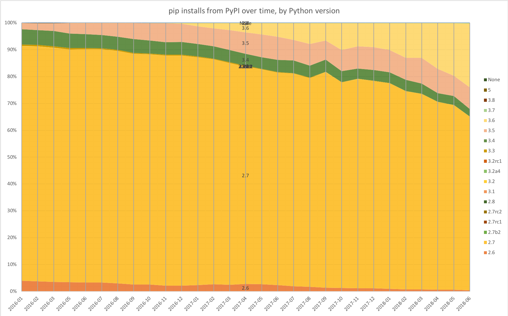
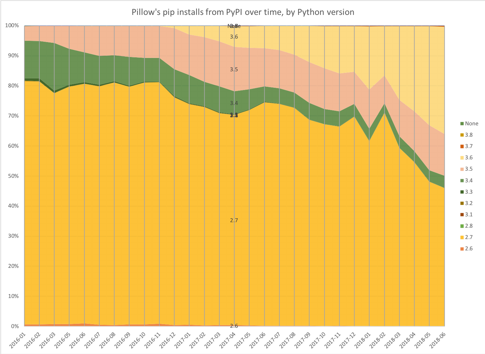

## January 2016 — June 2018

To celebrate the release of [Python 3.7](https://realpython.com/python37-new-features/)
on [27th June 2018](https://peps.python.org/pep-0537/), here’s some statistics showing
how much different Python versions have been used over the past two and a half years.

Here's the pip installs for all packages from the
[Python Package Index (PyPI)](https://pypi.org/), between January 2016 and June 2018:

<small>pip installs from PyPI over time, by Python version</small>

For the [NumPy](https://github.com/numpy/numpy) scientific computing library:

And for the [Pillow](https://github.com/python-pillow/Pillow) imaging library:

<small>Pillow's pip installs from PyPI over time, by Python version</small>

## How

Statistics were collected using
[pypi-trends.py](https://github.com/hugovk/pypi-tools/blob/master/pypi-trends.py), a
wrapper around [pypinfo](https://github.com/ofek/pypinfo) to fetch all monthly downloads
from the PyPI database on Google BigQuery and save them as JSON files. Data was
downloaded over three or four days as getting all months uses up a lot of free BigQuery
quota. Then
[jsons2csv.py](https://github.com/hugovk/pypi-tools/blob/master/jsons2csv.py) converts
them into a single CSV file for chart-wrangling in Excel. Raw CSV and JSON data is in
the [repo](https://github.com/hugovk/pypi-tools/tree/master/data).

## See also

Paul Kehrer fetched similar stats from BigQuery in December 2016, writing in
[Data Driven Decisions Using PyPI Download Statistics](https://langui.sh/2016/12/09/data-driven-decisions/):

> Data ingestion into the BigQuery data set was spotty prior to June 2016\*, but you can
> see a significant uptick in Python 3 based downloads over 2016.
> [If these trends continue…](https://frinkiac.com/caption/S08E11/289555)
>
> \* But it shouldn’t be biased, so these percentages are likely to be accurate.
