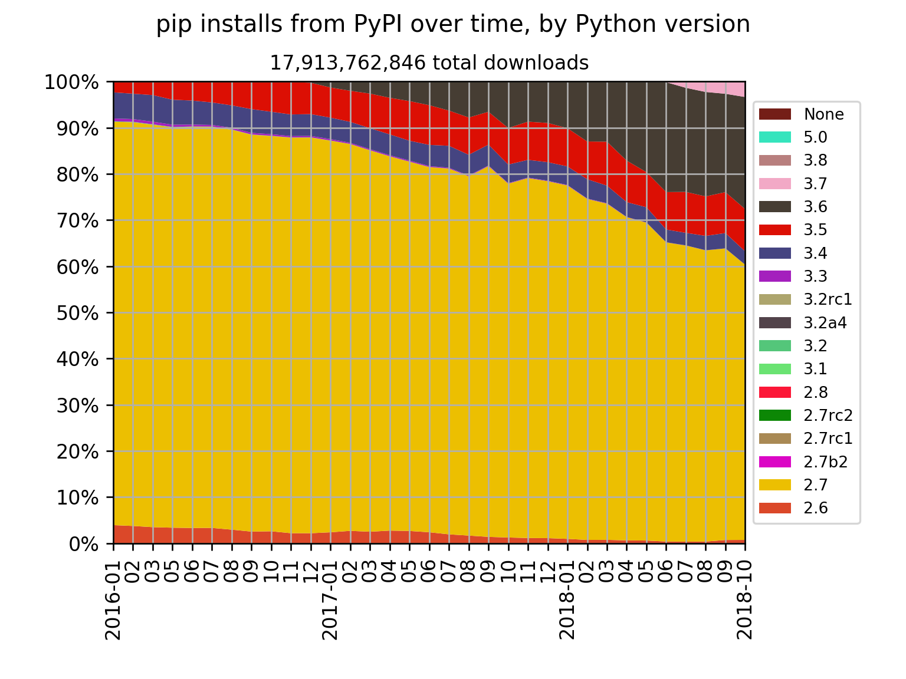
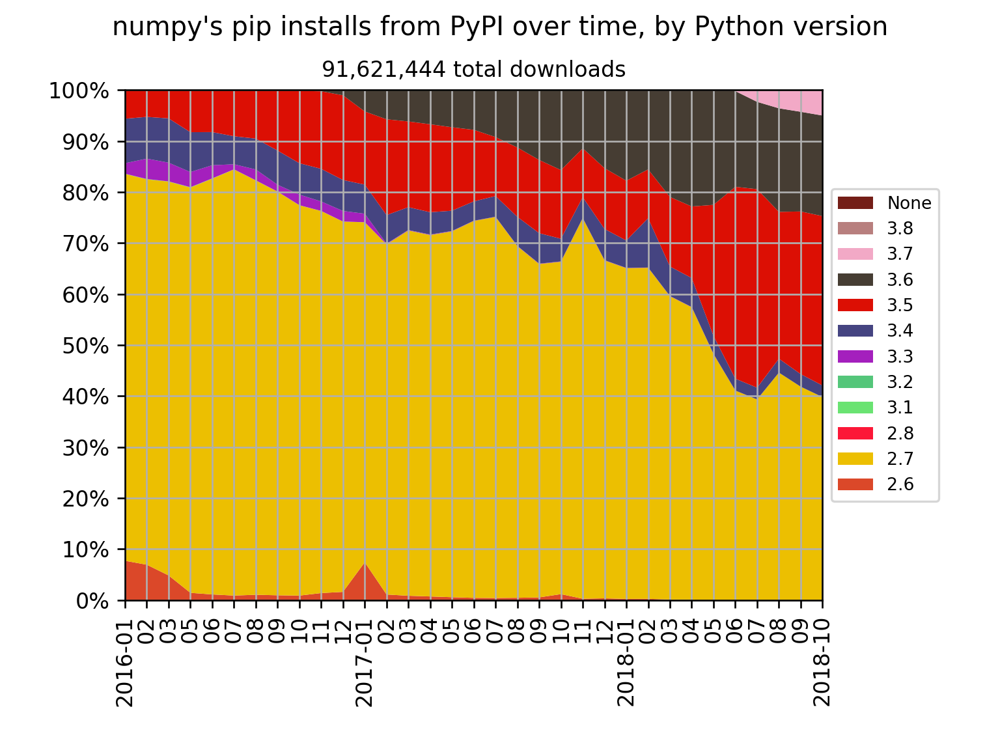
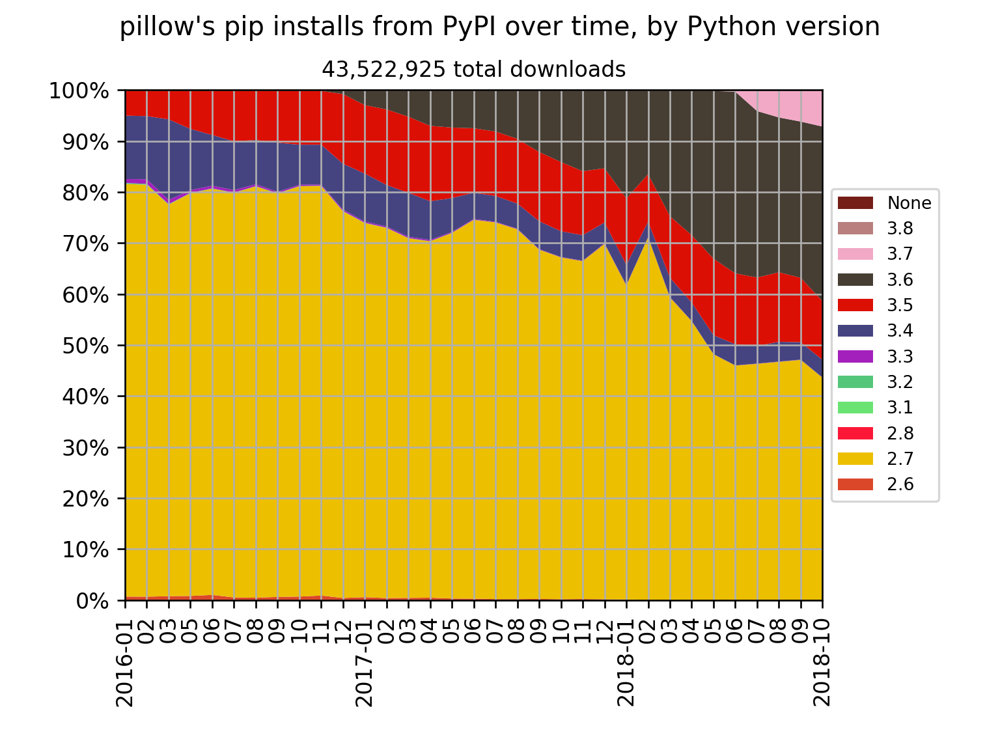
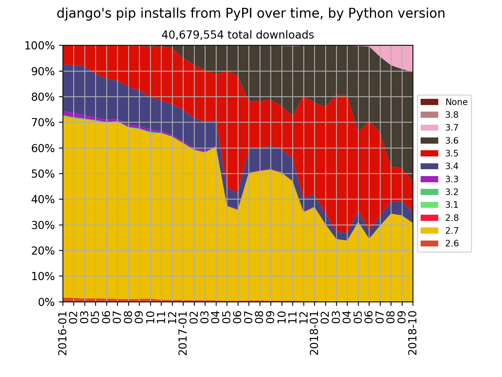
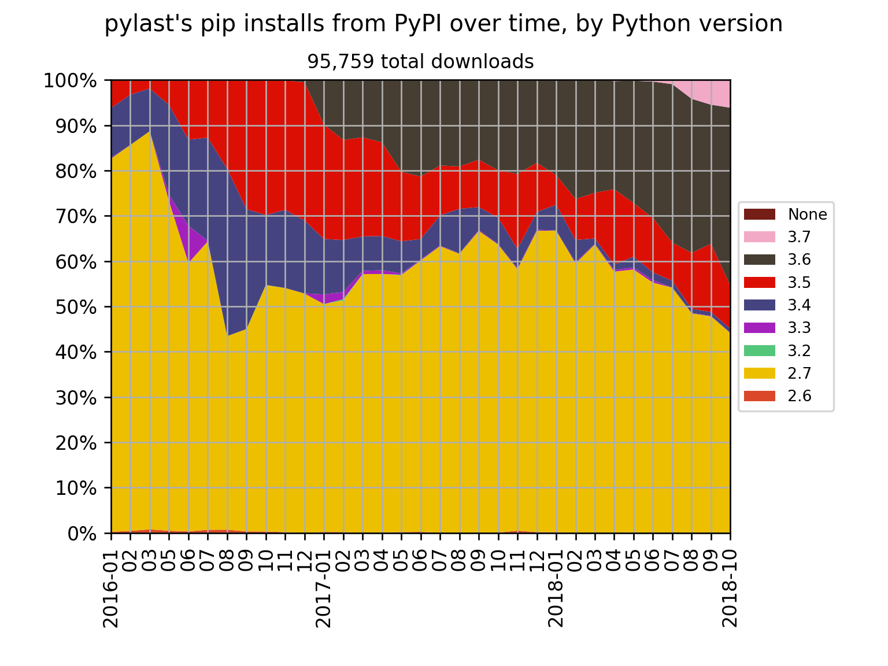

## January 2016 — October 2018

To celebrate the release of
[Python 3.7.1](https://www.python.org/downloads/release/python-371/) on
[20th October 2018](https://peps.python.org/pep-0537/), here’s some statistics showing
how much different Python versions have been used over the past two and five-sixths
years.

Here's the pip installs for all packages from the
[Python Package Index (PyPI)](https://pypi.org/), between January 2016 and October 2018:

<small>pip installs from PyPI over time, by Python version</small>

For the [NumPy](https://github.com/numpy/numpy) scientific computing library:

<small>Numpy's pip installs from PyPI over time, by Python version</small>

For the [Pillow](https://github.com/python-pillow/Pillow) imaging library:

<small>Pillow's pip installs from PyPI over time, by Python version</small>

For the [Django](https://github.com/django/django) web framework:

<small>pylast's pip installs from PyPI over time, by Python version</small>

And for the [pylast](https://github.com/pylast/pylast) interface to Last.fm:

<small>Pillow's pip installs from PyPI over time, by Python version</small>

## How

Statistics were collected using
[pypi-trends.py](https://github.com/hugovk/pypi-tools/blob/master/pypi-trends.py), a
wrapper around [pypinfo](https://github.com/ofek/pypinfo) to fetch all monthly downloads
from the PyPI database on Google BigQuery and save them as JSON files. Data was
downloaded over several days as getting all months uses up a lot of free BigQuery quota.
Then [jsons2csv.py](https://github.com/hugovk/pypi-tools/blob/master/jsons2csv.py) plots
a chart using [matplotlib](https://github.com/matplotlib/matplotlib). Raw JSON data is
in the [repo](https://github.com/hugovk/pypi-tools/tree/master/data).

## See also

- [Data Driven Decisions Using PyPI Download Statistics](https://langui.sh/2016/12/09/data-driven-decisions/)
- [Python version share over time,
  1]() (January
  2016 — June 2018)
- [PyPI Stats](https://pypistats.org/): See package download data for the past 180 days,
  without needing to sign up for BigQuery
- [pypistats](https://github.com/hugovk/pypistats): A command-line tool to access data
  from PyPI Stats
