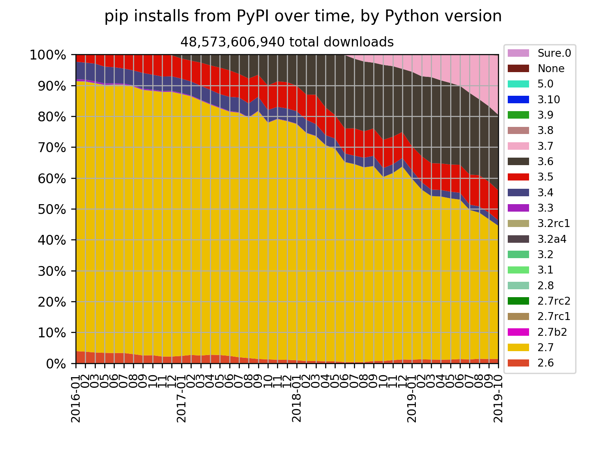

## January 2016 — October 2019

To celebrate the release of
[Python 3.8.0](https://discuss.python.org/t/python-3-8-0-is-now-available/2478?u=hugovk)
on [14th October 2019](https://peps.python.org/pep-0569/), and with
[less than two months left for Python 2](https://python2woop.pw/), here’s some
statistics showing how much different Python versions have been used over nearly four
years.

Here’s the pip installs for all packages from the
[Python Package Index (PyPI)](https://pypi.org/), between January 2016 and October 2019:

### [pip](https://github.com/pypa/pip)

The package installer

### [six](https://github.com/benjaminp/six)

Python 2 and 3 compatibility library

### [NumPy](https://github.com/numpy/numpy)

Scientific computing library

### [pytest](https://github.com/pytest-dev/pytest)

Testing framework

### [pandas](https://github.com/pandas-dev/pandas)

Data analysis toolkit

### [Coverage.py](https://github.com/nedbat/coveragepy)

Code coverage testing

### [Pillow](https://github.com/python-pillow/Pillow)

Imaging library

### [Django](https://github.com/python-pillow/Pillow)

Web framework

### [Matplotlib](https://github.com/matplotlib/matplotlib)

2D plotting library

### [Flake8](https://gitlab.com/pycqa/flake8)

Linter

### [Pylint](https://github.com/PyCQA/pylint/)

Linter

### [pylast](https://github.com/pylast/pylast)

Interface to Last.fm

## How

Statistics were collected using
[pypi-trends.py](https://github.com/hugovk/pypi-tools/blob/master/pypi-trends.py), a
wrapper around [pypinfo](https://github.com/ofek/pypinfo) and
[pypistats](https://github.com/hugovk/pypistats) to fetch all monthly downloads from the
PyPI database on Google BigQuery and save them as JSON files. Data was downloaded over
several days as getting all months uses up a lot of free BigQuery quota. Then
[jsons2csv.py](https://github.com/hugovk/pypi-tools/blob/master/jsons2csv.py) plots a
chart using [matplotlib](https://github.com/matplotlib/matplotlib). Raw JSON data is in
the [repo](https://github.com/hugovk/pypi-tools/tree/master/data).

## See also

- [Data Driven Decisions Using PyPI Download Statistics](https://langui.sh/2016/12/09/data-driven-decisions/)
- [Python version share over time,
  1]() (January
  2016 — June 2018)
- [Python version share over time,
  2]() (January
  2016 — October 2018)
- [Python version share over time, 3](../../2019/python-version-share-over-time-3/)
  (January 2016 — December 2018)
- [Python version share over time, 4](../../2019/python-version-share-over-time-4/)
  (January 2016 — March 2019)
- [PyPI Stats](https://pypistats.org/): See package download data for the past 180 days,
  without needing to sign up for BigQuery
- [pypistats](https://github.com/hugovk/pypistats): A command-line tool to access data
  from PyPI Stats
