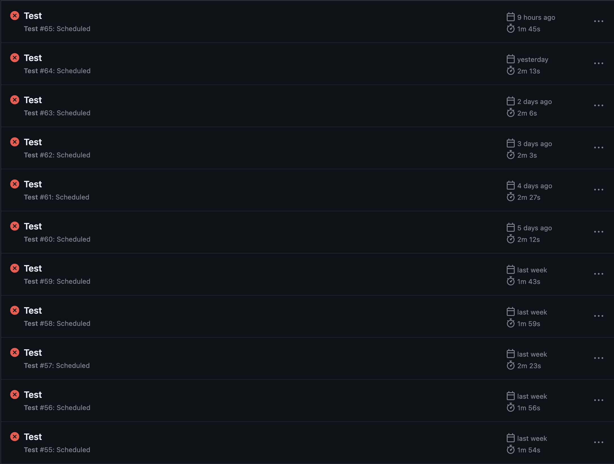
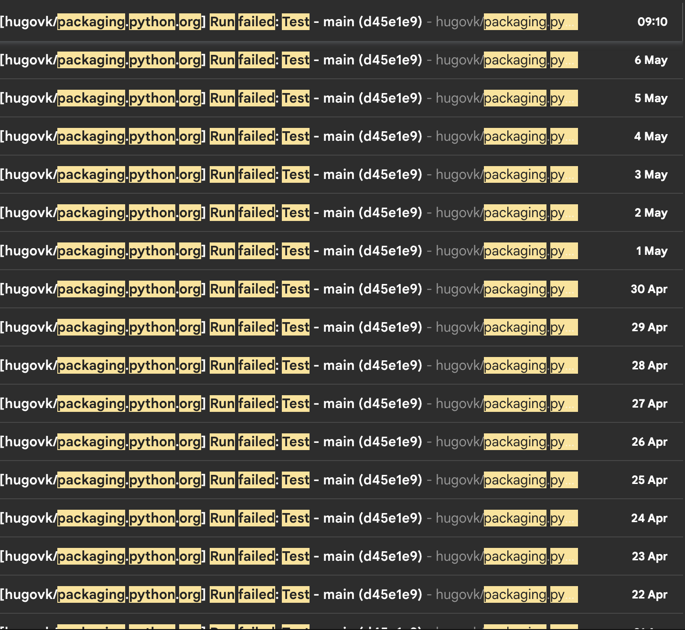

GitHub Actions has a useful feature to trigger workflows on a cron schedule. For
example:

```yml
name: Test

on:
  push:
  pull_request:
  schedule:
    - cron: "0 6 * * *" # daily at 6am

jobs:
  test:
    runs-on: ubuntu-latest

    steps:
      - uses: actions/checkout@v3
```

But if a contributor has enabled GitHub Actions on their fork (which I recommend: test
your contributions before opening a PR), it also runs the cron on their fork. This not
only uses up extra CI resources on the fork:



It also sends a regular email to the contributor when the workflow fails:



Instead, we only need to run the cron for the upstream. For example, for a
`https://github.com/octocat/hello-world` repo, add:

```diff
 jobs:
   test:
+    if: ${{ github.event.repository.fork == false || github.event_name != 'schedule' }}
     runs-on: ubuntu-latest
```

This only runs the `schedule` trigger for the (non-fork) upstream, and all other
triggers run for both upstream and forks.

## Also

For simpler workflows that only trigger on a cron, such as stalebot or CodeQL runs, we
can add a simpler condition.

For example:

```yml
name: Close stale issues

on:
  schedule:
    - cron: "10 0 * * *" # daily at 12:10am

jobs:
  stale:
    runs-on: ubuntu-latest

    steps:
      - name: "Check issues"
        uses: actions/stale@v8
```

We can completely disable it for forks:

```diff
 jobs:
   stale:
+    if: github.event.repository.fork == false
     runs-on: ubuntu-latest
```

## PS

Use single quotes in these lines, double quotes are invalid here (`Unexpected symbol`).

## Thanks

To [Alex Waygood](https://fosstodon.org/@AlexWaygood) for the tip.

To the British Library and Flickr Commons for the illustration of a
[chronograph](https://www.flickr.com/photos/britishlibrary/11097061804/).

## Update

2025-04-28: Instead of hardcoding the upstream repo's owner with
`github.repository_owner == 'octocat'`, use `github.event.repository.fork == false`.
This makes it easier to diff across projects in different organisations and consistent
config makes for easier maintenance.
