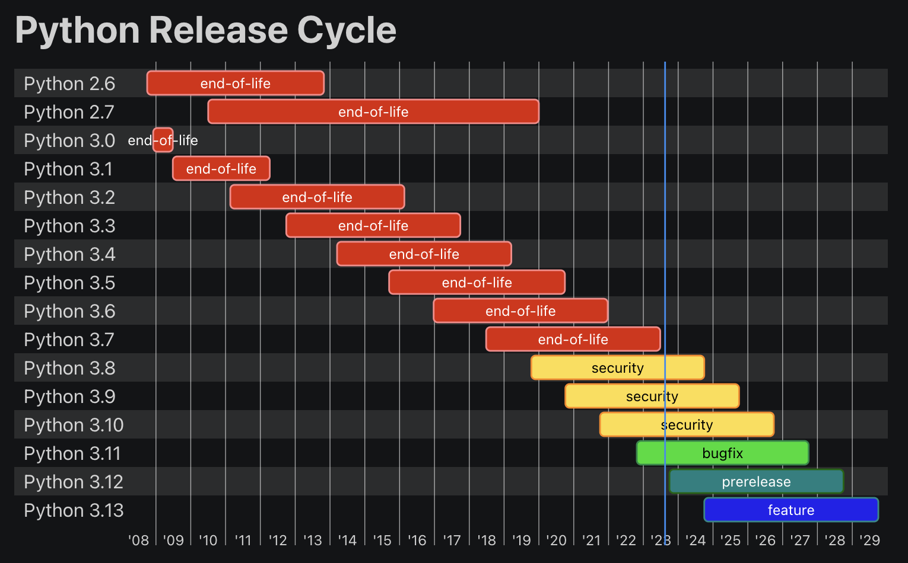
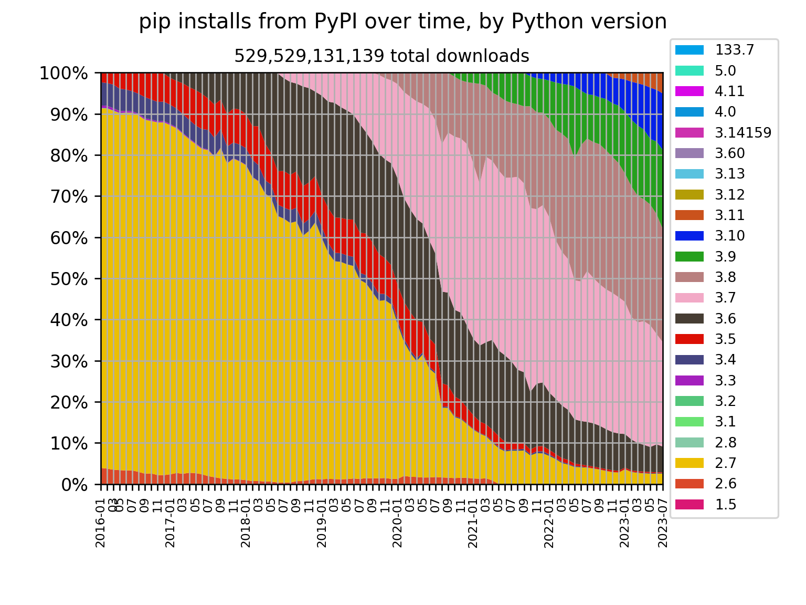

Python 3.7 was first released on 2018-06-27 and recently reached end-of-life on
2023-06-27 ([PEP 537](https://peps.python.org/pep-0537/)).

This means it is no longer receiving security updates and you should upgrade to a newer
version (at least 3.8, but preferably 3.11):

<small>Source: <a href="https://devguide.python.org/versions/">Python Developer's Guide</a></small>

However, if you look at download numbers from PyPI, 3.7 still accounts for a large share. 3.7 accounted for 25% of all downloads from PyPI in July 2023, compared with 27% for 3.8:

<small>Source: <a href="https://hugovk.github.io/pypi-tools/charts.html">pypi-tools</a></small>

But why does such an old Python version have so many downloads?

## All downloads

Let's dig into the numbers using a handy tool called
[pypinfo](https://github.com/ofek/pypinfo), which helps us analyse the
[PyPI data from Google BigQuery](https://packaging.python.org/en/latest/guides/analyzing-pypi-package-downloads/).

This command fetches all of yesterday's downloads per Python version:

`pypinfo --days 1 --percent --markdown "" pyversion`

| Python version | percent | download count |
| -------------- | ------: | -------------: |
| 3.8            |  25.00% |    189,678,872 |
| 3.7            |  23.35% |    177,150,010 |
| 3.9            |  20.25% |    153,663,903 |
| 3.10           |  15.52% |    117,751,108 |
| 3.11           |   6.90% |     52,381,884 |
| 3.6            |   6.29% |     47,749,879 |
| 2.7            |   2.32% |     17,602,650 |
| 3.5            |   0.23% |      1,778,388 |
| 3.4            |   0.10% |        770,135 |
| 3.12           |   0.03% |        224,223 |
| 3.13           |   0.00% |          3,920 |
| 3.3            |   0.00% |          1,165 |
| 2.8            |   0.00% |             57 |
| 3.2            |   0.00% |             35 |
| None           |   0.00% |              3 |
| Total          |         |    758,756,232 |

## All downloads by OS

But what happens if we check which distros are responsible for those downloads?

This command gives us the top 20:

`pypinfo --days 1 --limit 20 --percent --markdown "" system distro pyversion`

| system name | distro name      | Python version | percent | download count |
| ----------- | ---------------- | -------------- | ------: | -------------: |
| Linux       | Ubuntu           | 3.8            |  18.87% |    128,991,062 |
| Linux       | Amazon Linux     | 3.7            |  14.44% |     98,738,952 |
| Linux       | Ubuntu           | 3.9            |  12.14% |     83,019,828 |
| Linux       | Ubuntu           | 3.10           |   9.66% |     66,019,309 |
| Linux       | Ubuntu           | 3.7            |   5.89% |     40,257,060 |
| Linux       | Debian GNU/Linux | 3.8            |   5.70% |     38,958,367 |
| Linux       | Debian GNU/Linux | 3.9            |   5.63% |     38,482,436 |
| Linux       | Debian GNU/Linux | 3.7            |   4.25% |     29,035,532 |
| Linux       | Debian GNU/Linux | 3.10           |   4.15% |     28,348,346 |
| Linux       | Debian GNU/Linux | 3.6            |   3.14% |     21,441,883 |
| Linux       | Ubuntu           | 3.11           |   3.01% |     20,570,619 |
| Linux       | Debian GNU/Linux | 3.11           |   2.72% |     18,588,584 |
| Linux       | Amazon Linux     | 3.9            |   2.43% |     16,593,595 |
| Linux       | CentOS Linux     | 3.6            |   1.70% |     11,605,142 |
| Linux       | Amazon Linux     | 3.8            |   1.47% |     10,035,087 |
| Linux       | Amazon Linux     | 3.10           |   1.46% |      9,969,514 |
| Linux       | Ubuntu           | 2.7            |   1.02% |      6,960,697 |
| Linux       | Amazon Linux AMI | 3.6            |   0.79% |      5,390,823 |
| Linux       | Ubuntu           | 3.6            |   0.79% |      5,388,370 |
| Windows     | None             | 3.10           |   0.76% |      5,227,519 |
| Total       |                  |                |         |    683,622,725 |

We can see Ubuntu with 3.8 is responsible for the largest share of 17%. (That's fine,
3.8 is supported until 2024-10-14.)

The next is Amazon Linux with 3.7, responsible for a whopping 15% of all downloads!

The others responsible for 3.7 have a much lower share: Ubuntu (6%) and Debian (4%).

Tip: replace `""` in the commands above with a package name to get data for just that
package, for example:

`pypinfo --days 1 --limit 20 --percent --markdown requests system distro pyversion`

---

<small>Header photo: Space shuttle Discovery landing at Edwards Air Force Base,
California, 9th December, 1992
([source: NASA on The Commons](https://www.flickr.com/photos/nasacommons/30498961044))</small>
