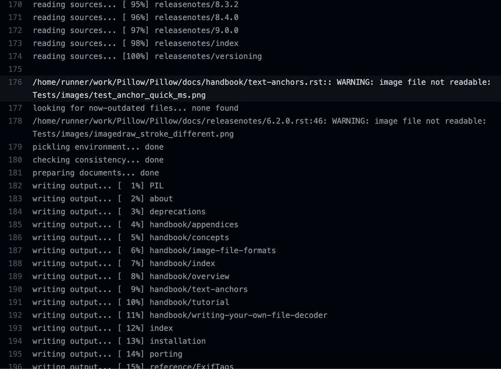
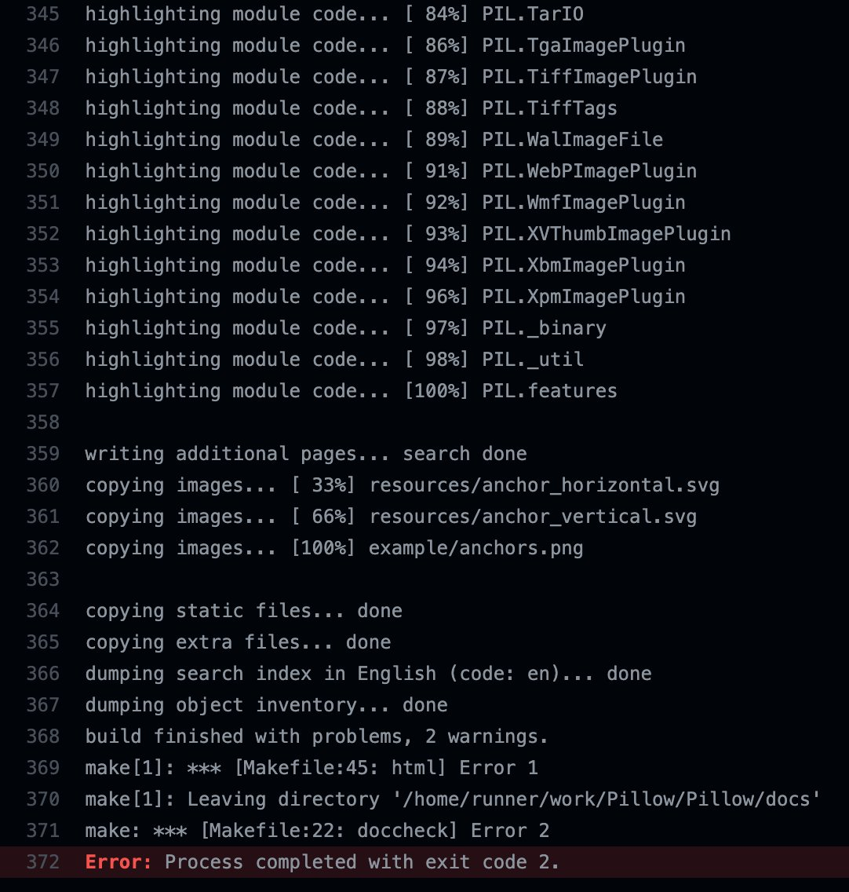
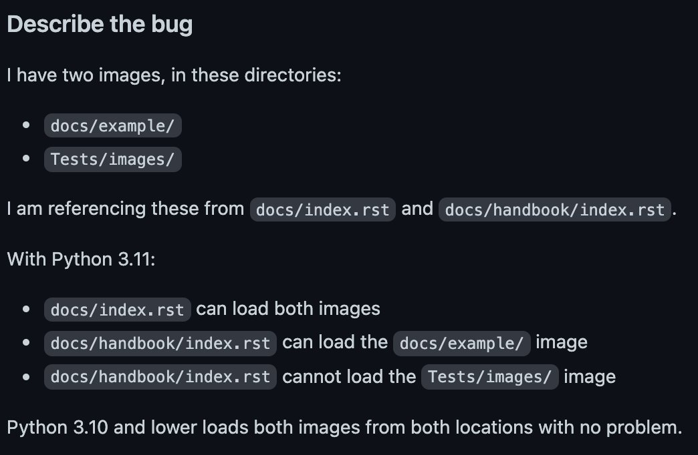
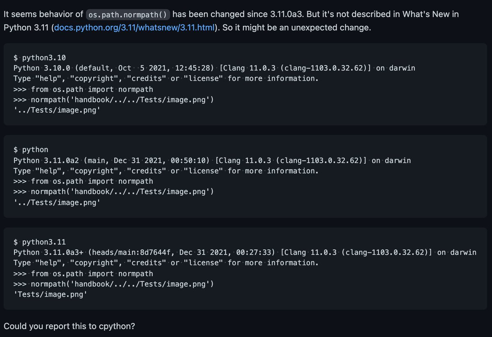

## Prologue

This was a [Twitter](https://www.wikihow.com/Delete-a-Twitter-Account)
[thread from 15th January 2022](https://web.archive.org/web/20220115150826/https://twitter.com/hugovk/status/1482367773577822208)
about my first CPython bug. Eight days from report to fix to merge, not bad!

---

## Delay

I helped
[delay the release of Python 3.11.0a4](https://web.archive.org/web/20220114231910/https://twitter.com/pyblogsal/status/1482128909286227972)!
But in a good way! 😇

Python 3.11 is due out in October, but they make early alpha, beta and release
candidates available for people to help test Python itself and their own code before the
big release.

So I tested [Pillow](https://fosstodon.org/@pillow)...

## Tests

The Pillow test suite passed with 3.11 ✅

Next I tried building the documentation with 3.11 ❌

The docs program, Sphinx, emitted a couple of warnings. Warnings are often missed
because they don't error. But luckily we use the "-W" option to turn warnings into hard
errors.

## Sphinx

Maybe Sphinx isn't ready for Python 3.11?

Rather than submitting a report with the full Pillow documentation (lots of files) I
made a
[new, "minimal" example with just enough stuff to reproduce it](https://github.com/hugovk/test/tree/3.11-sphinx).

This makes it easier to investigate what's up.

## Report 1

I [reported this to Sphinx](https://github.com/sphinx-doc/sphinx/issues/10030). The
problem was that a page in a subdirectory could load an image from one directory, but
not from another, further away directory.

It occurs for the Python 3.11.0a3 alpha, but not 3.7-3.10.

## CPython

A few hours later the Sphinx maintainer Takeshi said it looks like a change to a part of
Python itself -- `os.path.normpath()` -- since 3.11.0a3, and as it wasn't mentioned on
the ["What's New in Python 3.11"](https://docs.python.org/3/whatsnew/3.11.html) page it
could be a bug in Python.

He asked me to report it to Python.

## Report 2

I [reported it to Python](https://bugs.python.org/issue46208) with Takeshi's even more
minimal example.

Half an hour later Christian pointed out a change which may have caused this.

I tested and confirmed.

The next day Steve confirmed it was a bug and set it as a "release blocker".

## Fix

Steve also said it will needs tests, because this bug slipped out due to a gap in
testing.

I didn't know how to fix the bug, but I could write some test cases!

neonene then took the tests and
[fixed the bug](https://github.com/python/cpython/pull/30362)! In doing so they found
even more bugs!

## Merge

These extra bugs also existed in earlier versions.

But it turns out path handling can get pretty complicated in places, so Steve decided to
only fix my bug now to get it released and the others can be sorted later.

The fix was merged and I confirmed it also worked with Sphinx ✅

## Conclusion

And that's about it!

It's now fixed in 3.11.0a4; much better to find these before 3.11.0 final is released to
the world in October. Along the way we found more issues to address.

Short version: test your code with 3.11 now, you may find issues in your code or in
Python itself 🚀

---

## Epilogue

Back to 2025: Please test and delay
[Python 3.14 alpha](https://discuss.python.org/tag/release) -- but in a good way! 😇
