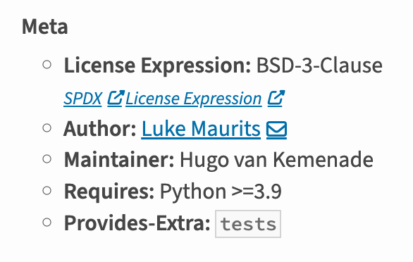

## What?

[PEP 639](https://peps.python.org/pep-0639/) defines a spec on how to document licences
used in Python projects.

Instead of using a [Trove classifier](https://pypi.org/classifiers/) such as "License ::
OSI Approved :: BSD License", which is imprecise (for example, which
[BSD licence](https://en.wikipedia.org/wiki/BSD_licenses)?), the
[SPDX licence expression syntax](https://spdx.github.io/spdx-spec/v2.2.2/SPDX-license-expressions/)
is used.

## How?

### `pypproject.toml`

Change `pyproject.toml` as follows.

I usually use Hatchling as a build backend, and support was added in 1.27:

```diff
 [build-system]
 build-backend = "hatchling.build"
 requires = [
   "hatch-vcs",
-  "hatchling",
+  "hatchling>=1.27",
 ]
```

Replace the freeform `license` field with a valid SPDX license expression, and add
`license-files` which points to the licence files in the repo. There's often only one,
but if you have more than one, list them all:

```diff
 [project]
 ...
-license = { text = "MIT" }
+license = "MIT"
+license-files = [ "LICENSE" ]
```

Optionally delete the deprecated licence classifier:

```diff
 classifiers = [
   "Development Status :: 5 - Production/Stable",
   "Intended Audience :: Developers",
-  "License :: OSI Approved :: MIT License",
   "Operating System :: OS Independent",
```

For example, see [humanize#236](https://github.com/python-humanize/humanize/pull/236)
and [prettytable#350](https://github.com/prettytable/prettytable/pull/350).

### Upload

Then make sure to use a PyPI uploader that supports this.

I recommend using [Trusted Publishing](https://docs.pypi.org/trusted-publishers/) which
I use with [pypa/gh-action-pypi-publish](https://github.com/pypa/gh-action-pypi-publish)
to deploy from GitHub Actions. I didn't need to make any changes here, just make a
release as usual.

## Result

### PyPI

PyPI [shows the new metadata](https://pypi.org/project/prettytable/3.13.0/):



### pip

pip can also show you the metadata:

```shell
❯ pip install prettytable==3.13.0
❯ pip show prettytable
Name: prettytable
Version: 3.13.0
...
License-Expression: BSD-3-Clause
Location: /Library/Frameworks/Python.framework/Versions/3.13/lib/python3.13/site-packages
Requires: wcwidth
Required-by: norwegianblue, pypistats
```

## Thank you!

A lot of work went into this. Thank you to PEP authors
[Philippe Ombredanne](https://github.com/pombredanne) for creating the first draft in
2019, to [C.A.M. Gerlach](https://github.com/cam-gerlach) for the second draft in 2021,
and especially to [Karolina Surma](https://karolinasurma.eu/) for getting the third
draft finish line and helping with the implementation.

And many projects were updated to support this, thanks to the maintainers and
contributors of at least:

- [PyPI/Warehouse](https://github.com/pypi/warehouse/issues/16620)
- [packaging 24.2](https://packaging.pypa.io/en/stable/changelog.html)
- [Hatchling 1.27](https://hatch.pypa.io/dev/history/hatchling/)
- [Twine 6.1.0](https://twine.readthedocs.io/en/stable/changelog.html)
- [PyPI publish GitHub Action v1.12.4](https://github.com/pypa/gh-action-pypi-publish/releases/tag/v1.12.4)
- [build-and-inspect-python-package v2.12.0](https://github.com/hynek/build-and-inspect-python-package/releases/tag/v2.12.0)
- [pip 25.0](https://ichard26.github.io/blog/2025/01/whats-new-in-pip-25.0/)

---

<small>Header photo:
<a target="_blank" rel="noopener noreferrer" href="https://www.flickr.com/photos/sdasmarchives/49801923846/">Amelia
Earhart's 1932 pilot licence</a> in the
<a target="_blank" rel="noopener noreferrer" href="https://www.flickr.com/photos/sdasmarchives/">San
Diego Air and Space Museum Archive</a>, with
<a target="_blank" rel="noopener noreferrer" href="https://www.flickr.com/commons/usage/">no
known copyright restrictions</a>.</small>
