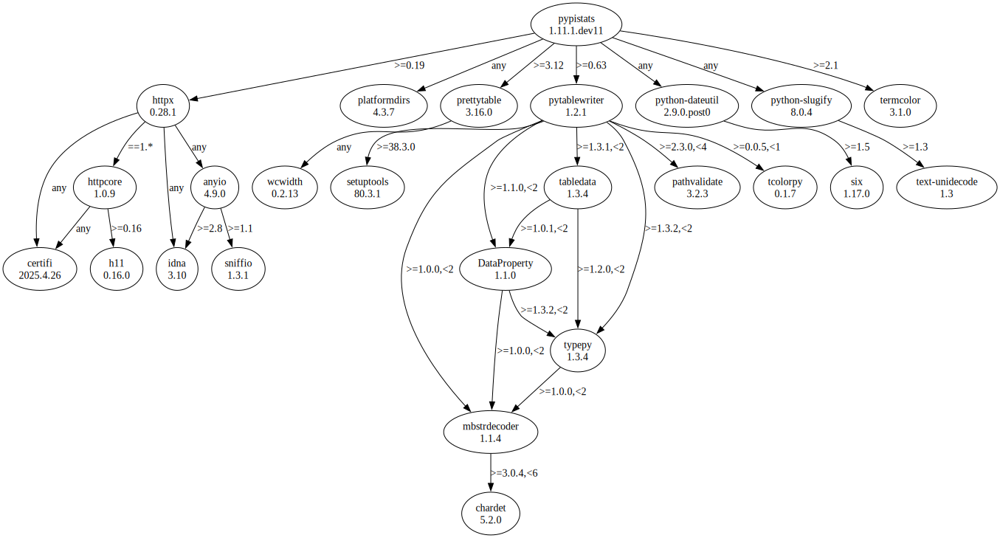
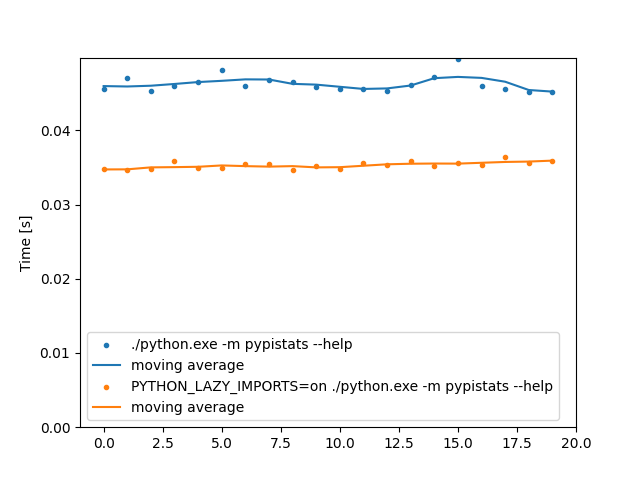
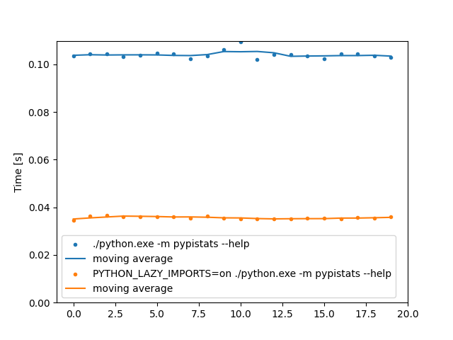

[PEP 810](https://peps.python.org/pep-0810/) proposes "explicit lazy imports" for Python
3.15:

> Lazy imports defer the loading and execution of a module until the first time the
> imported name is used, in contrast to ‘normal’ imports, which eagerly load and execute
> a module at the point of the import statement.
>
> By allowing developers to mark individual imports as lazy with explicit syntax, Python
> programs can reduce startup time, memory usage, and unnecessary work. This is
> particularly beneficial for command-line tools, test suites, and applications with
> large dependency graphs.

It's not been accepted yet, but let's try out the
[reference implementation](https://github.com/LazyImportsCabal/cpython/tree/lazy) on one
of my CLI tools, [pypistats](https://github.com/hugovk/pypistats).

## Setup

First fetch the reference implementation. From a CPython checkout:

```sh
git remote add LazyImportsCabal https://github.com/LazyImportsCabal/cpython
git fetch LazyImportsCabal
gco lazy  # see https://hugovk.dev/blog/2025/my-most-used-command-line-commands/
```

Because we want to install NumPy and pandas, let's pretend to be Python 3.14 so we can
use the binary wheels instead of having to build from source:

```diff
--- a/Include/patchlevel.h
+++ b/Include/patchlevel.h
 /* Version parsed out into numeric values */
 /*--start constants--*/
 #define PY_MAJOR_VERSION        3
-#define PY_MINOR_VERSION        15
+#define PY_MINOR_VERSION        14
 #define PY_MICRO_VERSION        0
 #define PY_RELEASE_LEVEL        PY_RELEASE_LEVEL_ALPHA
 #define PY_RELEASE_SERIAL       0

 /* Version as a string */
-#define PY_VERSION              "3.15.0a0"
+#define PY_VERSION              "3.14.0a0"
 /*--end constants--*/
```

```diff
--- a/configure.ac
+++ b/configure.ac
-m4_define([PYTHON_VERSION], [3.15])
+m4_define([PYTHON_VERSION], [3.14])
```

Build non-debug CPython with optimisations:

```sh
GDBM_CFLAGS="-I$(brew --prefix gdbm)/include" \
  GDBM_LIBS="-L$(brew --prefix gdbm)/lib -lgdbm" \
  ./configure --enable-optimizations --with-lto \
              --with-system-libmpdec --config-cache \
              --with-openssl="$(brew --prefix openssl@3)" && make -s -j8
```

Install NumPy and pandas:

```sh
./python.exe -m pip install numpy pandas
```

And then an editable install of the CLI, because we'll also test changing the imports:

```sh
./python.exe -m pip install -e ~/github/pypistats
```

Let's check the dependencies with [pipdeptree](https://github.com/tox-dev/pipdeptree):

```sh
uvx "pipdeptree[graphviz]" --python ./python.exe --packages pypistats --graph-output svg > pipdeptree.svg
```

pypistats has seven direct dependencies, which result in a total of 41 dependencies six
layers deep, not counting NumPy and pandas:



## Benchmarks

Let's benchmark running `pypistats --help`, which is meant to be quick, using
[hyperfine](https://github.com/sharkdp/hyperfine):

```sh
brew install hyperfine
```

### Inline imports

In the pypistats CLI, I had already applied the trick of moving heavier imports into the
functions that call them (the PEP calls these
["inline imports"](https://peps.python.org/pep-0810/#motivation)).

Instead of the [`lazy` keyword](https://peps.python.org/pep-0810/#specification), I'm
using the
[`PYTHON_LAZY_IMPORTS` env var](https://peps.python.org/pep-0810/#global-lazy-imports-control)
here to make it easy to compare two different runs.

```console
❯ hyperfine --warmup 10 --runs 20 --export-json out.json \
  "./python.exe -m pypistats --help" \
  "PYTHON_LAZY_IMPORTS=on ./python.exe -m pypistats --help"
Benchmark 1: ./python.exe -m pypistats --help
  Time (mean ± σ):      46.2 ms ±   1.1 ms    [User: 38.8 ms, System: 6.4 ms]
  Range (min … max):    45.1 ms …  49.6 ms    20 runs

Benchmark 2: PYTHON_LAZY_IMPORTS=on ./python.exe -m pypistats --help
  Time (mean ± σ):      35.3 ms ±   0.5 ms    [User: 29.5 ms, System: 4.8 ms]
  Range (min … max):    34.6 ms …  36.3 ms    20 runs

Summary
  PYTHON_LAZY_IMPORTS=on ./python.exe -m pypistats --help ran
    1.31 ± 0.04 times faster than ./python.exe -m pypistats --help
```

Plotted with
[plot_progression.py](https://github.com/sharkdp/hyperfine/tree/master/scripts):



From 46 to 35 milliseconds, or, 1.31 times faster, not bad.

### Fully lazy

But we no longer need the inline imports trick with PEP 810!

I modified the CLI so all imports are at the top, and also removed `if TYPE_CHECKING:`
guards. Here's a
[diff](https://github.com/hugovk/pypistats/commit/646bc6f70656df26d55a0bf4977a878a2b4379e5).

```console
❯ hyperfine --warmup 10 --runs 20 --export-json out2.json \
  "./python.exe -m pypistats --help" \
  "PYTHON_LAZY_IMPORTS=on ./python.exe -m pypistats --help"
Benchmark 1: ./python.exe -m pypistats --help
  Time (mean ± σ):     104.1 ms ±   1.6 ms    [User: 88.2 ms, System: 14.5 ms]
  Range (min … max):   101.9 ms … 109.5 ms    20 runs

Benchmark 2: PYTHON_LAZY_IMPORTS=on ./python.exe -m pypistats --help
  Time (mean ± σ):      35.7 ms ±   0.5 ms    [User: 29.8 ms, System: 4.8 ms]
  Range (min … max):    34.7 ms …  36.5 ms    20 runs

Summary
  PYTHON_LAZY_IMPORTS=on ./python.exe -m pypistats --help ran
    2.92 ± 0.06 times faster than ./python.exe -m pypistats --help
```



From 104 to 36 milliseconds, or 2.92 times faster, much better!

---

<small>Header photo:
<a target="_blank" rel="noopener noreferrer" href="https://flickr.com/photos/usnationalarchives/4272370812/">
"Lazy Man Fishing" at Cascade Locks on the Columbia River 05/1973</a> in the
<a target="_blank" rel="noopener noreferrer" href="https://flickr.com/photos/usnationalarchives/">U.S.
National Archives </a>, with
<a target="_blank" rel="noopener noreferrer" href="https://www.flickr.com/commons/usage/">no
known copyright restrictions</a>.</small>
