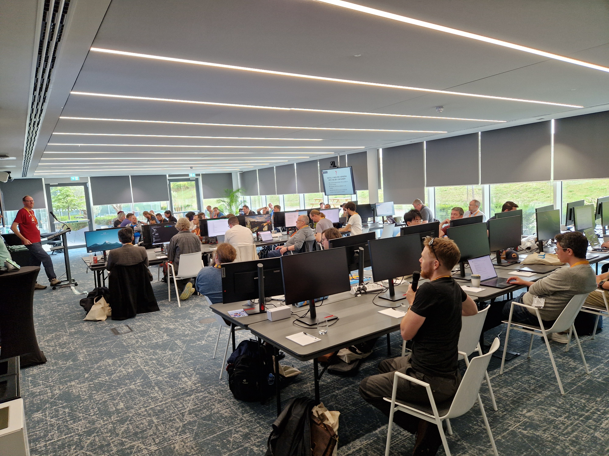
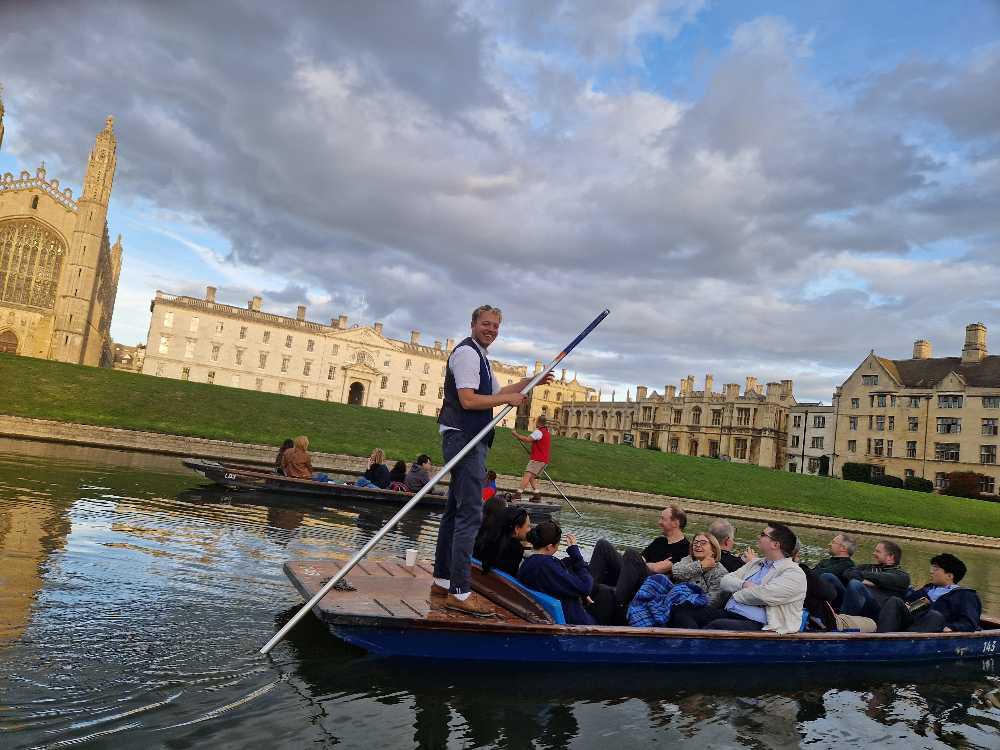
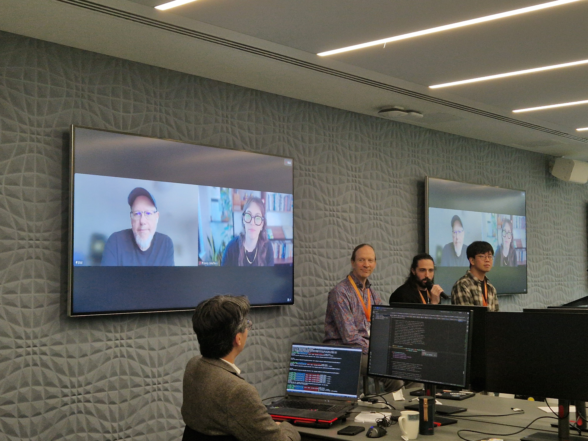
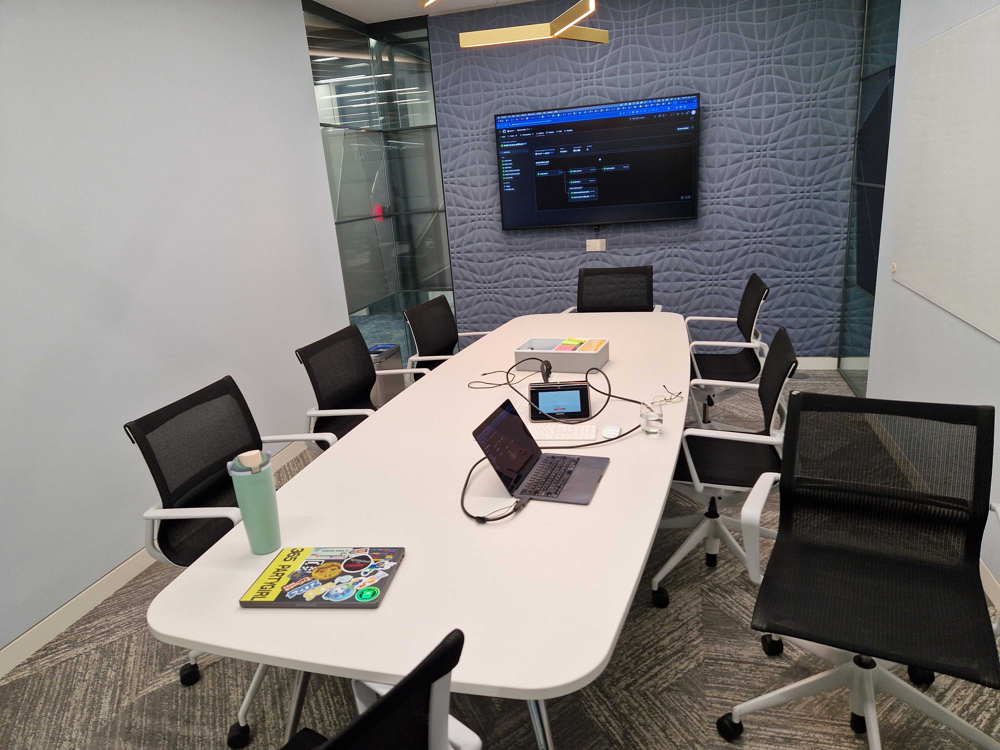

🐍🏃In September, the annual Python Core Sprint was hosted by
[Arm](https://developer.arm.com/) in Cambridge, UK!

The plan: put 35 core developers and 13 special guests in a room for a week, and see
what they cook up.

## Monday highlights

We kicked off the first day with a round of five-word intros (mine: "three", "dot",
"fourteen", "release", "manager"), lots of talks, and lots of discussion about talks:

- [Ken Jin Ooi](https://github.com/fidget-spinner) - Building a JIT Community _and_ Demo
  [effect] of new C API
- [Antonio Cuni](https://mastodon.social/@antocuni) - Tracing JITs on real code
- [Brett Cannon](https://mastodon.social/@brettcannon) - WASI update _and_ Precompiled
  binaries from python.org
- [Hood Chatham](https://github.com/hoodmane) - Upstreaming Pyodide FFI
- [Russell Keith-Magee](https://cloudisland.nz/@freakboy3742) - Managing cross-platform
  wheel builds
- [Steering Council](https://github.com/python/steering-council) -
  [PEP 793](https://peps.python.org/pep-0793/) and abi3/abi3t/abi4
- [Matthew Parkinson](https://github.com/mjp41) - Designing Deep Immutability

I did some ~~sprint~~ spring cleaning of our PyPI projects, dropping support for
[then-_almost_-EOL](https://devguide.python.org/versions/)
[Python 3.9](https://peps.python.org/pep-0596/):

- [python/blurb#68](https://github.com/python/blurb/pull/68)
- [python/cherry-picker#164](https://github.com/python/cherry-picker/pull/164)
- [python/peps#4587](https://github.com/python/peps/pull/4587)
- [python/pyperformance#414](https://github.com/python/pyperformance/pull/414)
- [sphinx-contrib/sphinx-lint#145](https://github.com/sphinx-contrib/sphinx-lint/pull/145)

And because [Mariatta](https://fosstodon.org/@mariatta) wasn't with us, here's the
all-important
[Python T-shirt census](https://mariatta.ca/posts/python-core-sprint-2024-day-1/#python-conference-t-shirts):

- [Menlo Park 2016 core sprint](https://pythoninsider.blogspot.com/2016/09/python-core-development-sprint-2016-36.html)
  (Greg, Guido)
- [EuroPython 2023](https://ep2023.europython.eu/) (Antonio)
- [EuroPython 2024 volunteer](https://ep2023.europython.eu/) (Hugo)
- [PyCon Canada 2016](https://2016.pycon.ca/en/) (Brett)
- [PyCon US](https://us.pycon.org/) Pittsburgh Charlas (Thomas)
- [Cambridge 2025 core sprint](https://hugovk.dev/blog/2025/python-core-sprint-2025/)
  (Diego)

<small>The sprint room</small>

## Tuesday highlights

Release day?

I'd originally planned to release [Python 3.14.0rc3](https://peps.python.org/pep-0745/)
on the Tuesday, but the morning was full of presentations, and the afternoon had an
early departure for the social event, so I moved it to Wednesday instead.

[Tania Allard](https://chaos.social/@trallard) gave a presentation about the different
types of mentorship and how we can improve, followed by an open discussion.

[Gregory P. Smith](https://infosec.exchange/@gpshead) gave a demo on how we can use
tools like Claude with CPython.

Tania, [Jannis Leidel](https://publicidentity.net/@jezdez),
[Carol Willing](https://hachyderm.io/@willingc) and I discussed the
[User Success Workgroup](https://github.com/psf/user-success-wg) and we came up with
some ideas on next steps.

We ended the day with a punting tour on the river Cam and dinner at Jesus College, thank
you, Arm!

And [Thomas Wouters](https://social.coop/@Yhg1s) gave a fun session of his
[Feuding Pythonistas game](https://discuss.python.org/t/shall-we-play-a-game/96085)
(spoiler: people are wrong on the internet).

Python/tech t-shirt census:

- Python ~2~3.7, Menlo Park 201~6~7 core sprint (Carl)
- [PyCon Italia 2025](https://2025.pycon.it/en) (Antonio)
- Python 3.14 pie (Hugo)
- [WHY 2025](https://why2025.org/) (Thomas)
- [PyCon US 2025](https://us.pycon.org/2025/) (Diego)
- [PyCascades](https://www.pycascades.com/) (Guido)
- [EuroPython 2022](https://ep2022.europython.eu/) (Mark)
- Pythonista (Jacob)

<small>Punting on the Cam</small>

## Wednesday highlights

Release day?

The Steering Council asked for an extra day to decide about a possible typing revert
([python/steering-council#307](https://github.com/python/steering-council/issues/307)),
so not today.

Lightning talks:

- ⚡ [Guido van Rossum](https://github.com/gvanrossum) on collecting an aural history
- ⚡ [Ee Durbin](https://mastodon.social/@EWDurbin) on modernising the last bits of
  infra and bots
- ⚡ [Steve Dower](https://github.com/zooba) demoed the new Windows installer
- ⚡ [Larry Hastings](https://github.com/larryhastings) on a `linked_list` date type
- ⚡ [Adam Turner](https://github.com/aa-turner) asked shall we close old issues
- ⚡ Greg shared a [draft PEP](https://github.com/python/peps/pull/4592) for timestamps
  on async tracebacks

Carol, Adam, Thomas, [Petr Viktorin](https://mastodon.social/@encukou) and I discussed a
number of docs topics.

I released the
[Python Docs Sphinx Theme ](https://github.com/python/python-docs-theme/releases/tag/2025.9.2)
with more translations.

We had a Q&A session with the Steering Council, three in-person and two joining
remotely.

[Jacob Coffee](https://fosstodon.org/@Monorepo) and I looked into upgrading the
[Python Insider](https://blog.python.org/) and [PSF](https://pyfound.blogspot.com/)
blogs into something a little more modern.

T-shirt census:

- [PyCon Greece 2025](https://2025.pycon.gr/en/) (Hugo)
- [PyCon Korea 2025](https://2025.pycon.kr/) (Donghee)
- [PyLadies](https://pyladies.com/) (Savannah, Petr)
- [EuroPython 2024](https://ep2023.europython.eu/) (Lys)
- [PyCon Italia 2023](https://2023.pycon.it/en) (Antonio)
- [Cambridge 2025 core sprint](https://hugovk.dev/blog/2025/python-core-sprint-2025/)
  (Guido)

<small>The Python Steering Council</small>

## Thursday highlights

Release day? Yes!

The Steering Council
[decided not to revert](https://discuss.python.org/t/types-uniontype-was-merged-with-wrong-class-not-even-a-class/102275/30),
so full steam ahead with the
[release](https://discuss.python.org/t/python-3-14-0rc3-is-go/103815).

[Savannah Ostrowski](https://fosstodon.org/@savannah), release manager for 3.16 and
3.17, [shadowed](https://bsky.app/profile/savannah.dev/post/3lz4ek7aw6224) to see what
the process looks like (not as bad as it looks like in
[PEP 101](https://peps.python.org/pep-0101/)).

Time for a couple of [quick](https://github.com/python/release-tools/pull/280)
[PRs](https://github.com/python/peps/pull/4596) and an interview with
[Pablo Galindo Salgado](https://bsky.app/profile/pablogsal.com) and
[Łukasz Langa](https://mastodon.social/@ambv) on the
[core.py podcast](https://creators.spotify.com/pod/profile/corepy/episodes/Episode-26-1-CPython-Sprint-Week-in-Cambridge-UK--Part-1-e39jabg),
along with 29 others!

T-census:

- [PyCon UA](https://web.archive.org/web/20160419232557/http://ua.pycon.org/) 2016
  (Łukasz)
- [Cambridge 2025 core sprint](https://hugovk.dev/blog/2025/python-core-sprint-2025/)
  (Donghee)
- [Read the Docs Budapest 2014](https://blog.readthedocs.com/read-the-docs-2014-stats/)
  (Petr)
- [Quansight Labs](https://labs.quansight.org/) "Sustaining the future of Open Source"
  hoodie (Lys)

<small>The 3.14.0rc3 release in progress</small>

## Friday highlights

I went to Manchester to attend [PyCon UK](https://2025.pyconuk.org/). Some highlights:

- [Python's True Superpower, Hynek Schlawack](https://www.youtube.com/watch?v=gDvwRpl9erE&list=PLrkpavSsBQZ6bnFa93KWXtMJoBA-a4_f_&index=2)
- [Ada by Emily Holyoake, a rehearsed reading](https://www.youtube.com/watch?v=CtrsssksCNU&list=PLrkpavSsBQZ41YpNF6EUDUB5wAwwfbKPV&index=7)
- [Localization and translation of programming languages, Felienne Hermans](https://youtube.com/watch?v=ri3Wli6PVVo&list=PLrkpavSsBQZ62noXYqRezmjdE7_CCbT9_&index=2)
- [The tale of PEP 765 SyntaxWarning on `return` in `finally`, Irit Katriel](https://www.youtube.com/watch?v=vrVXgeD2fts&list=PLrkpavSsBQZ62noXYqRezmjdE7_CCbT9_&index=7)
- [Oh no! Your project became really popular! Deb Nicholson](https://www.youtube.com/watch?v=sxT2UikIyeQ&list=PLrkpavSsBQZ6MjNYXtWm_YFEcrLkCxN2w&index=3)
- [Why `len('😶‍🌫️') == 4` and other weird things you should know about strings in Python, Yngve Mardal Moe & Marie Roald](https://www.youtube.com/watch?v=3MmfY5UIquk&list=PLrkpavSsBQZ6MjNYXtWm_YFEcrLkCxN2w&index=6)

The conference also included [sprints](https://2025.pyconuk.org/sprints/), and Adam and
I ran the CPython sprint. We had a big table full of contributors and a few made their
very first contributions, which is always rewarding for all involved!

<small>PyCon UK sprint</small>

Some numbers for me during the week:

- Python release candidates released: 1
- Issues created: 1
- PRs created: 8
- Issues closed: 7
- PRs merged: 28
- PRs closed: 1
- Total issues involved with: 18
- Total PRs involved with: 70
- Repositories affected: 19

## Thank you

Huge thanks to [Diego Russo](https://bsky.app/profile/did:plc:4vk3ag3wqcgrcrl2ax3xzcxt)
and [Arm](https://developer.arm.com/) for arranging and hosting us. The core sprint is
always a highlight of the year and an incredibly productive week.

Read writeups by
[Diego](https://community.arm.com/arm-community-blogs/b/tools-software-ides-blog/posts/cpython-core-dev-sprint-2025-at-arm-cambridge-the-biggest-one-yet)
and
[Antonio](https://antocuni.eu/2025/09/24/tracing-jits-in-the-real-world--cpython-core-dev-sprint/),
and I recommend listening to Łukasz and Pablo's core.py podcast for interviews with 18
([part one](https://creators.spotify.com/pod/profile/corepy/episodes/Episode-26-1-CPython-Sprint-Week-in-Cambridge-UK--Part-1-e39jabg))
and 12 sprinters
([part two](https://creators.spotify.com/pod/profile/corepy/episodes/Episode-26-2-CPython-Sprint-Week-in-Cambridge-UK--Part-2-e3a1hot)).
They're long, but it's fascinating to hear all the different things everyone is working
on.

<small>Header photo by Arm</small>
