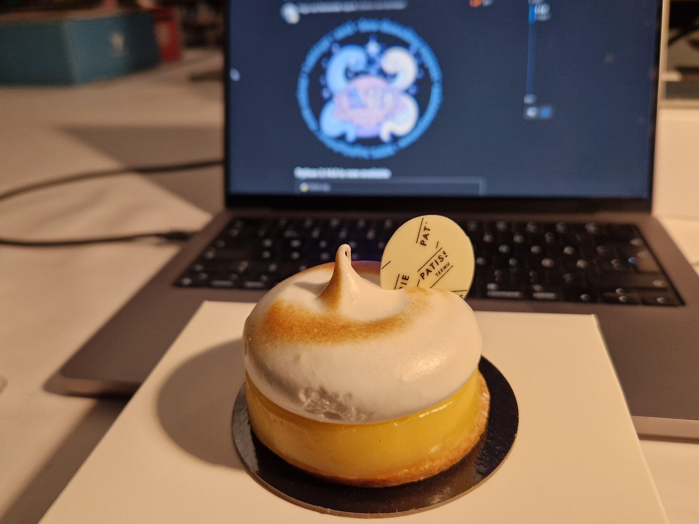

## Prologue

I livetooted the release of Python 3.14.0. Here it is in blogpost form!

---

## One week

Only [one week left](https://peps.python.org/pep-0745/) until the release of
[Python 3.14.0 final](https://docs.python.org/3.14/whatsnew/3.14.html)!

What are you looking forward to?

<small>[#Python](https://mastodon.social/tags/Python)
[#Python314](https://mastodon.social/tags/Python314) 
[_Tue, Sep 30, 2025, 15:19 EEST_](https://mastodon.social/@hugovk/115293209822115988)</small>

## Three days

Three days until release and a bug in the Linux kernel has turned a dozen
[buildbots](https://buildbot.python.org/#/release_status) red...

It's already been fixed in the kernel, but will take some time to bubble up. We'll skip
that test for relevant kernel versions in the meantime.

<small>[#Python](https://mastodon.social/tags/Python)
[#Python314](https://mastodon.social/tags/Python314) 
[_Sat, Oct 4, 2025, 16:15 EEST_](https://mastodon.social/@hugovk/115316079113681802)</small>

## Green

And back to green!

<small>[#Python](https://mastodon.social/tags/Python)
[#Python314](https://mastodon.social/tags/Python314) 
[_Sun, Oct 5, 2025, 16:58 EEST_](https://mastodon.social/@hugovk/115321909749435460)</small>

## Release day!

First off, check blockers and buildbots.

A new [release-blocker](https://github.com/python/cpython/labels/release-blocker)
appeared yesterday (because of course) but it can wait until 3.14.1.

Three [deferred-blockers](https://github.com/python/cpython/labels/deferred-blocker) are
also waiting until 3.14.1.

A new tier-2 [buildbot](https://buildbot.python.org/#/release_status) failure appeared
yesterday (because of course) but it had previously been offline for a month and will
need some reconfiguration. Can ignore.

OK, let's make a Python!

<small>[#Python](https://mastodon.social/tags/Python)
[#Python314](https://mastodon.social/tags/Python314)
[#release](https://mastodon.social/tags/release) 
[_Tue, Oct 7, 2025, 11:40 EEST_](https://mastodon.social/@hugovk/115331985979927140)</small>

## `run_release.py`

Next up, merge and backport the
[final change](https://github.com/python/cpython/pull/139631) to
[What's New in Python 3.14](https://docs.python.org/3/whatsnew/3.14.html) to declare it
latest stable.

Now start `run_release.py`, the main release automation script, which does a bunch of
pre-checks, runs blurb to create a merged changelog, bumps some numbers, and pushes a
branch and tag to my fork. It'll go upstream at the end of a successful build.

Then kick off the [CI](https://github.com/python/release-tools/actions/runs/18308460797)
to build source zips, docs and Android binaries.

<small>[#Python](https://mastodon.social/tags/Python)
[#Python314](https://mastodon.social/tags/Python314)
[#release](https://mastodon.social/tags/release) 
[_Tue, Oct 7, 2025, 12:43 EEST_](https://mastodon.social/@hugovk/115332234337389060)</small>

## Installers

(That's actually the second CI attempt, we had to update some script arguments following
an Android test runner update.)

This build takes about half an hour.

I've also informed the Windows and macOS release managers about the tag and they will
start up installer builds.

This takes a few hours, so I've got time to finish up the release notes.

[PEP 101](https://peps.python.org/pep-0101/) is the full process, but much is automated
and we don't need to follow it all manually.

<small>[#Python](https://mastodon.social/tags/Python)
[#Python314](https://mastodon.social/tags/Python314)
[#release](https://mastodon.social/tags/release) 
[_Tue, Oct 7, 2025, 12:52 EEST_](https://mastodon.social/@hugovk/115332266999944269)</small>

## Windows

The
[Windows build](https://dev.azure.com/Python/cpython/_build/results?buildId=164907&view=results)
has been started.

The jobs with profile-guided optimisation (PGO) build once, then collect a profile by
running the tests, and then build again using that profile, to see how 'real' code
executes and optimises for that.

Meanwhile, the docs+source+Android build has finished and the artifacts have been copied
to where they need to go with SBOMs created.

<small>[#Python](https://mastodon.social/tags/Python)
[#Python314](https://mastodon.social/tags/Python314)
[#release](https://mastodon.social/tags/release) 
[_Tue, Oct 7, 2025, 13:50 EEST_](https://mastodon.social/@hugovk/115332496234142659)</small>

## macOS

The Windows build is ready and macOS is underway.

<small>[#Python](https://mastodon.social/tags/Python)
[#Python314](https://mastodon.social/tags/Python314)
[#release](https://mastodon.social/tags/release) 
[_Tue, Oct 7, 2025, 15:36 EEST_](https://mastodon.social/@hugovk/115332912443887856)</small>

## Final steps

macOS installer done, next on to the final publishing and announcing steps.

<small>[#Python](https://mastodon.social/tags/Python)
[#Python314](https://mastodon.social/tags/Python314)
[#release](https://mastodon.social/tags/release) 
[_Tue, Oct 7, 2025, 17:02 EEST_](https://mastodon.social/@hugovk/115333249425273213)</small>

## 🚀 It's out!

🥧 Please install and enjoy
[Python 3.14](https://discuss.python.org/t/python-3-14-0-final-is-here/104210?u=hugovk)!

<small>[#Python](https://mastodon.social/tags/Python)
[#Python314](https://mastodon.social/tags/Python314)
[#release](https://mastodon.social/tags/release) 
[_Tue, Oct 7, 2025, 17:27 EEST_](https://mastodon.social/@hugovk/115333348041057866)</small>

## Finally

And the last few tasks: announce also on the
[blog](https://blog.python.org/2025/10/python-3140-final-is-here.html) &
[mailing lists](https://mail.python.org/archives/list/python-list@python.org/thread/UDOUFTTWDO7IXHLPQSHTEW2FWGF7ZY2C/),
update the [PEP](https://peps.python.org/pep-0745/) &
[downloads landing page](https://www.python.org/downloads/), fix
[Discourse post](https://discuss.python.org/t/python-3-14-0-final-is-here/104210?u=hugovk)
links, unlock the [`3.14` branch](https://github.com/python/cpython/tree/3.14) for the
core team to start landing PRs that didn't need to be in the RC, and eat the pie.

A HUGE thanks to [@sovtechfund](https://mastodon.social/@sovtechfund)
[Fellowship](https://hugovk.dev/blog/2025/im-excited-to-join-the-sovereign-tech-fellowship/)
for allowing me to dedicate my time on getting this out 🎉

<small>[#Python](https://mastodon.social/tags/Python)
[#Python314](https://mastodon.social/tags/Python314)
[#release](https://mastodon.social/tags/release) 
[_Tue, Oct 7, 2025, 19:28 EEST_](https://mastodon.social/@hugovk/115333826029083841)</small>
