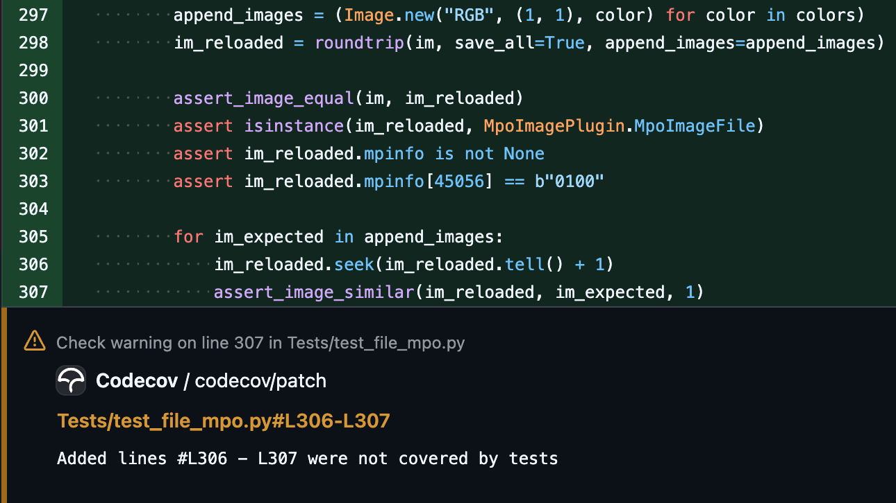

I recommend
[running](https://nedbatchelder.com/blog/201106/running_coverage_on_your_tests.html)
[coverage](https://nedbatchelder.com/blog/201908/dont_omit_tests_from_coverage.html)
[on your tests](https://nedbatchelder.com/blog/202008/you_should_include_your_tests_in_coverage.html).

Here's a couple of reasons why, from the past couple of months.

## Example one

When writing tests, it's common to copy and paste test functions, but sometimes you
forget to rename the new one (see also: the
[Last Line Effect](https://pvs-studio.com/en/blog/posts/cpp/0260/)).

For example:

```python
def test_get_install_to_run_with_platform(patched_installs):
    i = installs.get_install_to_run("<none>", None, "1.0-32")
    assert i["id"] == "PythonCore-1.0-32"
    assert i["executable"].match("python.exe")
    i = installs.get_install_to_run("<none>", None, "2.0-arm64")
    assert i["id"] == "PythonCore-2.0-arm64"
    assert i["executable"].match("python.exe")


def test_get_install_to_run_with_platform(patched_installs):
    i = installs.get_install_to_run("<none>", None, "1.0-32", windowed=True)
    assert i["id"] == "PythonCore-1.0-32"
    assert i["executable"].match("pythonw.exe")
    i = installs.get_install_to_run("<none>", None, "2.0-arm64", windowed=True)
    assert i["id"] == "PythonCore-2.0-arm64"
    assert i["executable"].match("pythonw.exe")
```

The tests pass, but the first one is never run because its name is redefined. This
clearly shows up as a non-run test in the coverage report. In this
[case](https://github.com/python/pymanager/pull/17), we only need to rename one of them,
and both are covered and pass.

But [sometimes](https://github.com/python/cpython/pull/109139) there's a bug in the test
which would cause it to fail, but we just don't know because it's not run.

 **Tip 1:** This can also be found by
[Ruff's F811 rule](https://docs.astral.sh/ruff/rules/redefined-while-unused/).
 &nbsp;  **Tip 2:**
[pytest's parametrize](https://docs.pytest.org/en/stable/how-to/parametrize.html) is a
great way to combine similar test functions with different input data. 

## Example two

This is more subtle:

```python
im = Image.new("RGB", (1, 1))
for colors in (("#f00",), ("#f00", "#0f0")):
    append_images = (Image.new("RGB", (1, 1), color) for color in colors)
    im_reloaded = roundtrip(im, save_all=True, append_images=append_images)

    assert_image_equal(im, im_reloaded)
    assert isinstance(im_reloaded, MpoImagePlugin.MpoImageFile)
    assert im_reloaded.mpinfo is not None
    assert im_reloaded.mpinfo[45056] == b"0100"

    for im_expected in append_images:
        im_reloaded.seek(im_reloaded.tell() + 1)
        assert_image_similar(im_reloaded, im_expected, 1)
```

It's not so obvious when looking at the code, but Codecov highlights a problem:



The `append_images` generator is being consumed inside `roundtrip()`, so we have nothing
to iterate over in the `for` loop -- hence no coverage. The
[fix](https://github.com/python-pillow/Pillow/pull/8979#discussion_r2172250301) is to
use a list instead of a generator.

---

<small>Header photo: Misplaced manhole cover
(<a target="_blank" rel="noopener noreferrer" href="https://creativecommons.org/licenses/by-nc-sa/2.0/">CC
BY-NC-SA 2.0</a>
[Hugo van Kemenade](https://www.flickr.com/photos/hugovk/10375735084/)).</small>
