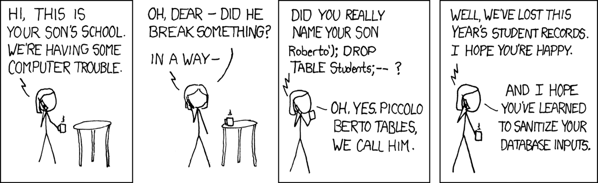
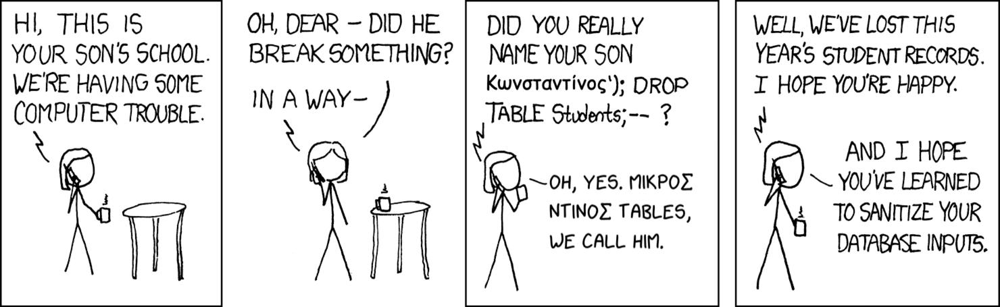
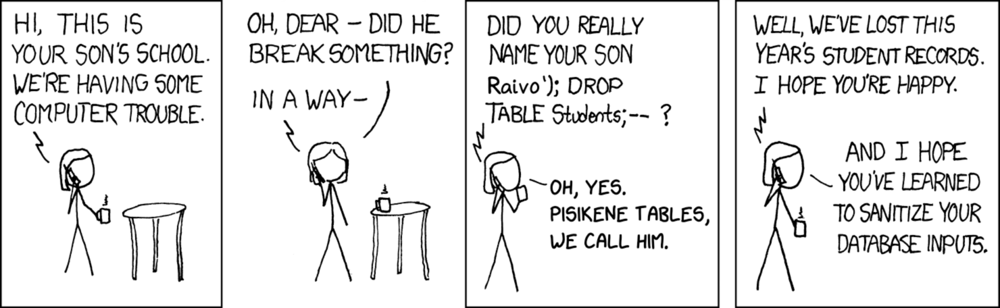
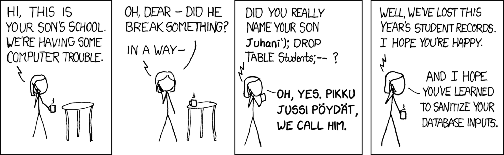
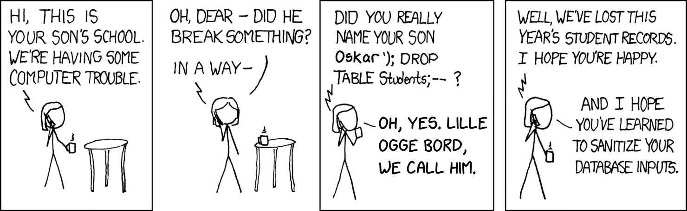

I gave a lightning talk at a bunch of conferences in 2025 about some of the exciting new
things coming in [Python 3.14](https://hugovk.dev/blog/2025/and-now/), including
[template strings](https://t-strings.help/).

One thing we can use t-strings for is to prevent SQL injection. The user gives you an
untrusted t-string, and you can sanitise it, before using it in a safer way.

I illustrated this with [xkcd 327](https://xkcd.com/327/), titled "Exploits of a Mom",
but commonly known as "Little Bobby Tables".

I localised most of the slides for the PyCon I was at, including this comic. Here they
are!

## PyCon Italia

_May, Bologna_

## PyCon Greece

_August, Athens_

## PyCon Estonia

_October, Tallinn_

## PyCon Finland

_October, Jyväskylä_

## PyCon Sweden

_October, Stockholm_

## Thanks

Thanks to Randall Munroe for licensing the comic under the
[Creative Commons Attribution-NonCommercial 2.5 License](https://creativecommons.org/licenses/by-nc/2.5/).
These adaptations are therefore licensed the same way.

Finally, here's links for 2026, I recommend them all:

- [PyCon Italia, 27-30 May](https://2026.pycon.it/en): the
  [CFP](https://2026.pycon.it/en/call-for-proposals) is open until 6th January
- [PyCon Estonia, 8-9 October](https://pycon.ee/)
- [PyCon Greece, 12-13 October](https://2026.pycon.gr/)
- [PyCon Sweden, TBA](https://pycon.se/)
- [PyCon Finland, TBA](http://fi.pycon.org/)
